# ao-sky Benchmarking

## Purpose

This document records benchmark evidence that informs `ao-sky` storage,
scheduling, and cache decisions.

It is now the active benchmark record for this repository. Relevant historical
benchmark material from the legacy implementation has been consolidated here so
`ao-sky` planning does not depend on scattered documents in other repositories.

## Source And Status

- The historical measurements below were originally gathered on `2026-04-01`
  during the pre-`ao-sky` planning work in the legacy implementation.
- They were measured before the current local-SSD failure and should therefore
  be treated as historical baselines rather than current operating truth.
- They still matter because they constrain what had already been learned about
  Gaia I/O, end-to-end build behavior, and HDF5 storage.
- Any new cache-policy decision for `ao-sky` should refresh the relevant
  benchmarks under the current storage setup before the implementation is
  treated as settled.

## Retained Planning Conclusions

- Canonical Gaia storage should use compressed HDF5.
- The canonical storage unit should remain one file per outer pixel.
- The hour/declination/pixel directory organization should remain in place.
- Direct HDD access is poor for many-small-files Gaia access patterns.
- Neighbour-oriented traversal, restart-aware execution, and better scheduling
  remain the main optimization targets.
- The historical evidence did not justify a custom multi-tier cache
  architecture or an always-on local hot cache layered over a fast staged copy.
- The Phase 13 optimization pass kept regional long-lived workers and the
  worker-local prepared Gaia table cache, but did not retain speculative read
  prewarm or write-behind artifact writes as active execution paths.

## 2026-04-17 Phase 14 Synthetic Traversal Smoke

Purpose:

- check the CPU and memory shape of the Phase 14 winner-map-first Traversal
  implementation before running expensive real-sky validation
- stress adaptive candidate capping, field-of-regard bitsets, candidate-pixel
  streaming, top-K winner state, local regularization, and retained winner
  catalog construction without model-inference cost

Setup:

- synthetic Gaia tables generated around one `outer_level=6` outer pixel
- `ao_system.min_wfs=1`, `ao_system.max_wfs=3`
- fake resolved and averaged predictors returned deterministic arrays so the
  measured cost is Traversal-side CPU and memory rather than model runtime
- RSS was sampled with process high-water `ru_maxrss`, so values include Python
  import/runtime overhead and are best read as relative smoke-test evidence

### Synthetic Cases

| Case | Inner Pixels | Input Stars | Candidate Budget | Adaptive NGS | Candidate Identities | Retained Winners | Winner Pixels | Wall | CPU | RSS Delta |
| --- | ---: | ---: | ---: | ---: | ---: | ---: | ---: | ---: | ---: | ---: |
| Dense budget 256 | 256 | 200 | 256 | not recorded | not recorded | 1 | 1 | 0.120 s | 0.120 s | 19.4 MiB |
| Dense default 4096 | 4096 | 400 | 4096 | not recorded | not recorded | 5 | 5 | 0.143 s | 0.143 s | 6.2 MiB |
| Sparse default 4096 | 4096 | 400 | 4096 | not recorded | not recorded | 161 | 350 | 0.115 s | 0.115 s | 0.2 MiB |
| Dense default 65536 | 65536 | 1000 | 65536 | 73 | 63249 | 27 | 72 | 5.598 s | 5.596 s | 76.7 MiB |

For the dense default-65536 case, the adaptive graph details were:

| Raw Stage A Estimate | Stage B Estimate | Close-Pair Edges | Graph Triangles | Budget Exceed Reason | Graph Time |
| ---: | ---: | ---: | ---: | --- | ---: |
| 260246 | 63249 | 2605 | 60571 | none | 0.214 s |

Interpretation:

- The adaptive cap did what it was designed to do in a deliberately dense
  synthetic field: 1,000 available NGS rows were reduced to 73 adaptive NGS
  rows while preserving a candidate count just under the default 65,536 budget.
- The large smoke run stayed CPU-bound and single-process wall time matched CPU
  time, which is expected with fake predictors and no real Gaia I/O.
- The observed RSS increase was modest relative to the previous multi-GiB
  legacy materialization problem. The main remaining production risk is real
  model-inference cost and real-sky candidate-pixel row counts, which Phase 15
  should measure carefully before all-sky execution.

## 2026-04-17 Phase 14 Real-Data Traversal Benchmark

Purpose:

- run the Phase 14 winner-map-first Traversal implementation on the same
  fixed real-sky sample used by the Phase 13 Traversal benchmarks
- compare runtime and memory against the documented Phase 13 baseline
- verify that the adaptive `max_mag` candidate budget, bitset eligibility,
  top-K winner state, local winner regularization, retained winner catalog, and
  final averaged winner prediction operate on real Gaia/model data

Setup:

- source config: `/Volumes/Data/Galaxy/aosky/gnao-baseline/ao-sky.yaml`
- benchmark script writes a schema-version-2 benchmark config copy for each
  scratch build, adding the Phase 14 `asterism` and bright-star exclusion
  fields when the live source config has not yet been migrated in place
- Gaia and dust root: `/Users/nelsonnunes/ao-sky-cache/gaia`
- model root:
  `/Users/nelsonnunes/Library/CloudStorage/Dropbox/Projects/survey_tools/data/models`
- worker count: `3`
- worker Gaia cache: `8` entries, `128 MiB`
- historical worker peak-RSS guard: `6144 MiB`
- regional combination work: default inner pixel count per outer pixel
  (`65,536` for `outer_level=6`, `inner_level=14`)
- default internal prediction batch size after CPU tuning: `25,000` rows
- later MPS comparison runs used `AO_SKY_PREDICTION_BATCH_SIZE=100000`
  because MPS only became competitive for large resolved batches
- sample source:
  `/Volumes/Data/Galaxy/aosky/benchmark-runs/ao-sky-compression-sweep-bench-20260416-212643/sample-pixels.ecsv`

### Regularizer Optimization Check

The first detailed real-data sample showed that the initial scalar local
regularizer was too expensive. It computed HEALPix neighbours in a Python loop
for every inner pixel. Replacing that with a vectorized neighbour matrix and
vectorized support counting kept the same local rule but removed the dominant
regularization overhead.

| Run | Pixels | Workers | Telemetry | Wall | Avg Pixel | Local Selection/Px | Point Prediction/Px | Averaged Prediction/Px | Peak RSS |
| --- | ---: | ---: | --- | ---: | ---: | ---: | ---: | ---: | ---: |
| before vectorized regularizer | `12` | `3` | detailed | `47.926 s` | `3.706 s` | `2.230 s` | `0.979 s` | `0.278 s` | `1001.4 MiB` |
| after vectorized regularizer | `12` | `3` | detailed | `21.685 s` | `1.542 s` | `0.076 s` | `0.976 s` | `0.277 s` | `992.5 MiB` |

The 12-pixel sample is one contiguous region, so it mostly exercises one
regional worker. It is useful for per-pixel stage shape, not worker scaling.

Detailed row-count shape after the regularizer optimization:

| Intermediate | Average Per Pixel | Peak Pixel | Interpretation |
| --- | ---: | ---: | --- |
| Expanded search stars | `2488` rows | `2597` rows | Stars loaded for the outer pixel plus two-ring boundary footprint |
| Search NGS rows | `1106` rows | `1183` rows | Rows available before adaptive magnitude limiting |
| Adaptive candidate identities | `4402` rows | `5207` rows | Exact one-, two-, and three-star combinations retained under the default candidate budget |
| Stage A raw estimate | `260246` rows | n/a | Cheap raw-combination estimate before graph-constrained Stage B limiting |
| Candidate/inner evaluation pairs | `93864` rows | `103886` rows | Resolved model rows streamed through the top-K winner state |
| Retained winning asterisms | `2404` rows | `2624` rows | Unique regularized winners persisted in the outer-pixel asterism table |
| Winner inner pixels | `38427` rows | `39450` rows | Inner pixels with a regularized winning asterism |
| Inner artifact structured array | `5.125 MiB` | n/a | Dense inner rows copied for HDF5 writing |
| Asterism artifact structured array | `0.308 MiB` | n/a | Retained asterism rows copied for HDF5 writing |

### Prediction Feature Path Optimization

The next detailed sample confirmed that the expensive "prediction" bucket was
not only model inference. It also included Python construction of
`list[list[dict]]` NGS payloads, backend conversion of those payloads into
feature matrices, and row-by-row top-K scatter updates. Phase 14 now builds the
model feature matrix directly from vectorized NumPy arrays and updates top-K
state with a batch sort/scatter.

The direct array feature path was checked against the pre-optimization
list/dict path by comparing the 12 generated `outer.h5` artifacts from the same
sample. Core inner performance and winner columns matched exactly:
`best_ee`, `best_sr`, `best_fwhm`, `winner_asterism_id`,
`winner_ee_resolved`, `winner_ee_averaged`, `coverage_resolved`, and
`coverage_averaged`.

Batch-size tuning on the same 12-pixel sample:

| Feature Path | Batch Size | Wall | Avg Pixel | Point Prediction/Px | Averaged Prediction/Px | Peak RSS |
| --- | ---: | ---: | ---: | ---: | ---: | ---: |
| Python payloads | `10000` | `21.685 s` | `1.542 s` | `0.976 s` | `0.277 s` | `992.5 MiB` |
| NumPy arrays | `100000` | `13.788 s` | `0.785 s` | `0.380 s` | `0.113 s` | `2750.3 MiB` |
| NumPy arrays | `50000` | `12.236 s` | `0.756 s` | `0.365 s` | `0.112 s` | `2095.9 MiB` |
| NumPy arrays | `25000` | `12.128 s` | `0.766 s` | `0.367 s` | `0.111 s` | `2016.8 MiB` |
| NumPy arrays | `10000` | `13.490 s` | `0.807 s` | `0.383 s` | `0.118 s` | `980.7 MiB` |

Interpretation:

- direct feature construction removes most of the Python payload overhead while
  preserving the same predictions
- `25,000` rows is the best current speed/memory compromise on this sample; it
  is effectively tied with `50,000` rows in wall time but keeps peak RSS
  slightly lower
- `10,000` rows is a useful fallback if higher-density Phase 15 samples show
  memory pressure, but it gives up throughput on this benchmark

### Fixed 288-Pixel Sample

Benchmark build root:

`/Volumes/Data/Galaxy/aosky/benchmark-runs/ao-sky-traversal-baseline-20260417-104810`

Results:

| Case | Completed Pixels | Wall | Elapsed | Pixels/s | Avg Pixel | Point Prediction/Px | Averaged Prediction/Px | Local Selection/Px | Avg Artifact Write | Artifact Size/Px | Gaia Load | Peak RSS |
| --- | ---: | ---: | ---: | ---: | ---: | ---: | ---: | ---: | ---: | ---: | ---: | ---: |
| Phase 13 post-dust-cache, 3 workers | `288` | `137.491 s` | n/a | `2.095` | `1.332 s` | n/a | n/a | n/a | `0.036 s` | `0.531 MiB` | n/a | `1060.7 MiB` |
| Phase 14 winner-map-first | `288` | `97.484 s` | `96.653 s` | `2.980` | `0.932 s` | `0.484 s` | `0.147 s` | `0.083 s` | `0.050 s` | `1.060 MiB` | `6.813 s` | `2272.2 MiB` |

Interpretation:

- The optimized Phase 14 real-data path is about `29%` faster than the
  post-dust-cache Phase 13 `3`-worker fixed-sample runtime while doing more
  work: one-star asterisms are now included, overlap pruning is no longer
  selecting a small retained catalog before prediction, and the averaged model
  is evaluated for the final regularized winner field.
- Resolved plus averaged prediction remains the largest cost, but direct
  vectorized feature construction reduced it from about `1.41 s/pixel` to
  about `0.63 s/pixel`.
- The vectorized local regularizer is no longer a major bottleneck at
  about `0.08 s/pixel`.
- Artifact size roughly doubled because Phase 14 retains unique winning
  asterisms rather than the smaller overlap-pruned legacy catalog.
- Peak worker RSS is materially higher than the post-dust-cache Phase 13
  baseline on this sample: `2272.2 MiB` versus `1060.7 MiB`. The earlier
  `3710.3 MiB` Phase 13 result measured the pre-mmap dust high-water behavior
  and should not be used as the memory baseline for Phase 14.
- The old `2048 MiB` per-worker target was practical for post-dust-cache
  Phase 13, but Phase 14 with real prediction can exceed it. Phase 15 should
  repeat this on higher-density fields before choosing the all-sky memory guard
  and prediction batch-size default.
- The implementation is worth further review and Phase 15 physical validation,
  but the main remaining performance risk is model-call volume on dense fields
  rather than avoidable Python payload construction.

## 2026-04-01 Storage Baseline

Purpose:

- measure raw device behavior before changing Gaia storage or caching design
- separate sustained transfer performance from many-small-files seek behavior

Devices tested:

- HDD: `/Volumes/Data`
- External SSD: `/Volumes/DataSSD`
- Local SSD: system-local storage

### Sequential Read Baseline

| Device | Read Size | Time | Throughput |
| --- | ---: | ---: | ---: |
| HDD | 1024.0 MiB | 4.31 s | 237.4 MiB/s |
| DataSSD | 1024.0 MiB | 1.07 s | 959.6 MiB/s |
| Local SSD | 1024.0 MiB | 0.17 s | 6147.6 MiB/s |

### Many-Small-Files Baseline

| Device | Files | Bytes Read | Time | Files/s |
| --- | ---: | ---: | ---: | ---: |
| HDD | 5000 | 19.5 MiB | 27.38 s | 182.6 |
| DataSSD | 5000 | 19.5 MiB | 1.41 s | 3548.4 |
| Local SSD | 5000 | 19.5 MiB | 1.30 s | 3847.3 |

Interpretation:

- HDD was acceptable for sustained transfer but very poor for seek-heavy
  many-file access.
- DataSSD was already close to local SSD for the critical small-file pattern.
- The historical evidence supported testing staging away from HDD before
  considering a more complex local-cache design. Later Traversal benchmarks did
  not justify retaining artifact staging as an active execution path.

## 2026-04-01 Gaia Access-Pattern Baseline

Purpose:

- measure Gaia HEALPix read behavior more directly than the raw storage
  baseline
- compare one-file, neighbour-heavy, and small-cluster access patterns

Benchmark region:

- central outer pixel: `41430`
- cluster: `41425, 41427, 41428, 41429, 41430, 41433`
- local subset staged for comparison: `22` Gaia files including required
  neighbours

### Initial Access-Pattern Comparison

| Scenario | HDD | DataSSD | Local Workspace Copy |
| --- | ---: | ---: | ---: |
| `SINGLE` | 0.0976 s | 0.0051 s | 0.0107 s |
| `NEIGHBOURS` | 0.2546 s | 0.0659 s | 0.0814 s |
| `CLUSTER_PASS1` | 0.6492 s | 0.3886 s | 0.5232 s |
| `CLUSTER_PASS2` | 0.3730 s | 0.3977 s | 0.5092 s |

### Repeated Local Comparison Using `/tmp`

| Scenario | DataSSD | `/tmp` Local SSD |
| --- | ---: | ---: |
| `SINGLE` | 0.0156 s | 0.0097 s |
| `NEIGHBOURS` | 0.0624 s | 0.0814 s |
| `CLUSTER_PASS1` | 0.3646 s | 0.3799 s |
| `CLUSTER_PASS2` | 0.3975 s | 0.4056 s |

Interpretation:

- HDD remained much worse for cold Gaia access.
- DataSSD was already strong for the actual Gaia HEALPix read pattern.
- A true local-SSD subset copy under `/tmp` was only marginally better for the
  one-file case and effectively the same as DataSSD for neighbour-heavy and
  clustered reads.
- The historical evidence favored `DataSSD Pre-stage` over a more elaborate
  local hot-cache design.

## 2026-04-01 Build Worker Baseline

Purpose:

- measure a build-like outer-pixel workflow rather than raw file reads
- compare single-pixel and mixed-density runs
- check whether storage remained dominant once asterism work was included

Important setup notes:

- The benchmark used `_build_outer_pix()` directly because the full
  `build_inner()` path could not be run in that workspace.
- Asterism quality was forced onto the built-in non-model heuristic.
- Gaia was accessed through temporary wrapper roots so the benchmark could read
  the restored legacy tree without changing the benchmark contract.

### Single Outer Pixel (`4727`)

| Storage | Total Wall | Inner Total | Inner Gaia Load | Asterism Total | Asterism Star Load | Asterisms Found |
| --- | ---: | ---: | ---: | ---: | ---: | ---: |
| HDD | 3.304 s | 0.091 s | 0.038 s | 3.212 s | 0.392 s | 856 |
| DataSSD | 2.540 s | 0.027 s | 0.006 s | 2.512 s | 0.052 s | 856 |

### 5-Pixel Mixed-Density Batch

| Storage | Workers | Total Wall | Per Pixel |
| --- | ---: | ---: | ---: |
| HDD | 1 | 83.182 s | 16.636 s |
| HDD | 5 | 61.240 s | 12.248 s |
| DataSSD | 1 | 82.336 s | 16.467 s |
| DataSSD | 5 | 105.300 s | 21.060 s |

Interpretation:

- DataSSD clearly improved cold single-pixel Gaia load time.
- Even so, most single-pixel wall time was not raw Gaia I/O.
- For the 5-pixel mixed-density run at `cores=1`, HDD and DataSSD were nearly
  identical.
- For this benchmark shape, compute and scheduling overhead dominated enough
  that storage alone did not explain most end-to-end runtime.
- The historical evidence did not justify assuming that more workers or more
  cache layers automatically improve throughput.

## 2026-04-01 Local-Only Comparison

Purpose:

- compare a true local-SSD staging run against the prior HDD and DataSSD worker
  benchmarks
- decide whether a bounded local cache had meaningful upside over DataSSD

Setup:

- staged the working set into `/tmp/gaia-benchmark-local-full/dr3-hpx6`
- copied the exact 5 benchmark pixels plus their immediate neighbours
- reused the same `_build_outer_pix()` worker benchmark and non-model heuristic

### Single Outer Pixel (`4727`)

| Storage | Total Wall | Inner Gaia Load | Asterism Star Load |
| --- | ---: | ---: | ---: |
| HDD | 3.304 s | 0.038 s | 0.392 s |
| DataSSD | 2.540 s | 0.006 s | 0.052 s |
| Local `/tmp` | 2.857 s | 0.017 s | 0.093 s |

### 5-Pixel Mixed-Density Batch At `cores=1`

| Storage | Total Wall | Per Pixel |
| --- | ---: | ---: |
| HDD | 83.182 s | 16.636 s |
| DataSSD | 82.336 s | 16.467 s |
| Local `/tmp` | 81.510 s | 16.302 s |

Interpretation:

- The local-only run did not beat DataSSD on the single-pixel benchmark.
- For the 5-pixel mixed-density batch at `cores=1`, local `/tmp`, DataSSD, and
  HDD were effectively the same.
- The historical evidence did not support preferring a bounded local cache over
  DataSSD for that benchmark shape.

## 2026-04-01 HDF5 Size Comparison

Purpose:

- compare existing Gaia FITS files against compressed HDF5 equivalents
- decide whether format should be chosen on storage-efficiency grounds

### Single-File Comparison

| Artifact | Size |
| --- | ---: |
| FITS | 13,826,880 bytes |
| HDF5 (`gzip=9`, `shuffle=True`) | 8,498,866 bytes |
| Size change | -38.5% |

### Worst-Case Level-5 Parent Comparison

| Artifact | Size |
| --- | ---: |
| Four child FITS files total | 301,858,560 bytes |
| Grouped HDF5 with one dataset per child | 151,859,481 bytes |
| Grouped size change | -49.7% |
| Combined HDF5 with one dataset | 131,826,282 bytes |
| Combined size change | -56.3% |

Interpretation:

- Compressed HDF5 was materially smaller than the FITS representation for real
  Gaia files.
- Grouping at level 5 was physically feasible, but remained a separate design
  choice from format.
- The retained design decision is compressed HDF5 with one file per outer
  pixel.

## 2026-04-16 Phase 13 Traversal Optimization Samples

Purpose:

- measure the Phase 13 Traversal optimization path across IO, memory,
  compression, and worker-count scaling on the current live GNAO build path
- keep the samples conservative, restartable, and memory-guarded
- separate useful execution settings from settings that only move bottlenecks

Common setup for the initial probes:

- source build lineage: `/Volumes/Data/Galaxy/aosky/gnao-baseline/v1`
- Gaia root: `/Volumes/Data/Galaxy/aosky`
- worker count: `3`
- worker Gaia cache: `8` entries, `128 MiB`
- historical worker peak-RSS guard: `6144 MiB`
- measurement method: short restart/run samples, stopped before completion
- benchmark caveat: the live build scheduler can hit uneven-density work; the
  write-behind comparison used scratch copies of the same `build.h5` and
  `build.yaml` under `/tmp` so each cap started from the same state
- later fixed-sample subsections record their own Gaia root, worker count,
  telemetry, compression, and memory-guard overrides

### Current Traversal Stage Baseline

Purpose:

- measure the current baseline after settling on SSD Gaia, worker-local prepared
  Gaia table caching, Blosc Zstd derived artifacts, and direct HDD writes
- break worker pixel time into the main Traversal stages that were previously
  grouped under "Other Traversal work"
- keep the same `18` region / `288` outer-pixel sample used for the compression
  and staging comparisons

Setup:

- source build lineage: `/Volumes/Data/Galaxy/aosky/gnao-baseline/v1`
- Gaia root: `/Users/nelsonnunes/ao-sky-cache/gaia`
- benchmark build root:
  `/Volumes/Data/Galaxy/aosky/benchmark-runs/ao-sky-traversal-baseline-20260416-225527`
- worker count: `3`
- worker Gaia cache: `8` entries, `128 MiB`
- historical worker peak-RSS guard: `6144 MiB`
- sample source:
  `/Volumes/Data/Galaxy/aosky/benchmark-runs/ao-sky-compression-sweep-bench-20260416-212643/sample-pixels.ecsv`

Results:

- Gaia read/prep is separated from asterism star selection in this view, so
  "Star selection, excluding Gaia read/prep" is the measured star-selection
  bucket minus Gaia load/prep telemetry.
- Rows are additive and sum to the measured `1.470 s/pixel` worker total.

| Stage | Per Pixel | Interpretation |
| --- | ---: | --- |
| Overlap geometry filtering | `0.442 s` | FOV-level grouping, neighbour search, center separations, overlap-area tests, and keep/drop decisions |
| Bright-star filtering | `0.246 s` | Candidate-center rejection around bright stars |
| Candidate generation | `0.216 s` | `find_asterisms()` over prepared NGS rows |
| Point prediction + winner selection | `0.216 s` | Point-model prediction plus best/winner field updates |
| Dust injection | `0.117 s` | Gaia TGE `gaia_A0` injection |
| Field-mean prediction | `0.044 s` | Averaged EE prediction for selected winners |
| Overlap quality prediction | `0.043 s` | Asterism-quality prediction used to rank overlap choices |
| HDF5 artifact write | `0.041 s` | Direct Blosc Zstd `outer.h5` write |
| Prediction context setup | `0.032 s` | Inner/asterism/star plane offsets and candidate inner-pixel matching |
| Star selection, excluding Gaia read/prep | `0.029 s` | Boundary-neighbour star assembly, locality filtering, runtime row validation, NGS filtering |
| Gaia read/prep | `0.021 s` | SSD Gaia file reads plus runtime prep: proper motion, `R`, `hpx14`, read-only table preparation |
| Base inner table construction | `0.018 s` | Dense inner rows plus star, NGS, and asterism counts |
| Unprofiled Traversal overhead | `0.004 s` | Residual timing gap |
| Coverage assignment | `<0.001 s` | Resolved and averaged coverage threshold booleans |
| Inner-pixel assignment | `<0.001 s` | Assign filtered asterism centers to inner HEALPix pixels |
| Local asterism selection | `<0.001 s` | Split retained local asterisms from expanded-neighbour asterisms |
| Persisted asterism shaping | `<0.001 s` | Retained local asterism output shaping |
| **Total worker pixel time** | **`1.470 s`** | Sum of measured per-pixel worker buckets |

Run summary:

- wall time: `152.081 s`
- worker elapsed time: `148.029 s`
- throughput: `1.946 pixels/s`
- artifact size: `152.8 MiB` total, `0.531 MiB/pixel`
- Gaia load/prep telemetry: `6.185 s` total (`3.746 s` raw load,
  `2.438 s` runtime prep). This is not an additive row in the raw table because it
  is part of asterism star selection.
- worker cache: `829` hits, `2051` misses, `2027` evictions, `0.288` hit ratio
- Gaia cache peak: `2.4 MiB`
- peak worker RSS: `3521.1 MiB`

Memory-shape telemetry:

This table comes from a detailed telemetry run. Detailed telemetry is opt-in
(`--telemetry detailed`) and writes raw per-pixel RSS checkpoints plus row-count
context to `<build>/diagnostics/traversal-memory.csv`; normal production runs
keep only the lower-cost build-log telemetry.

| Intermediate | Average Per Pixel | Peak Pixel | Interpretation |
| --- | ---: | ---: | --- |
| Expanded search stars | `2474` rows | `3151` rows | Stars loaded for the outer pixel plus two-ring boundary footprint |
| Search NGS rows | `1100` rows | `1399` rows | Rows entering `find_asterisms()` after magnitude filtering |
| Close star-pair rows | `5057` rows | `7733` rows | Full `search_around_sky()` pair result materialized before pruning |
| Raw asterism rows | `3260` rows | `5684` rows | Candidate asterisms before bright-star and overlap filtering |
| Post-bright-star rows | `3209` rows | n/a | Bright-star exclusion removes little in this sample |
| Post-overlap rows | `586` rows | n/a | Overlap filtering is the largest row-count reducer |
| Local retained asterisms | `471` rows | `622` rows | Persisted local asterism subset |
| Inner/asterism candidate pairs | `25585` rows | `33640` rows | Full inner-pixel/asterism match table materialized before point prediction batching |
| Winner payloads | `9452` objects | `12766` objects | Python NGS payload objects retained until field-mean prediction |
| Inner artifact structured array | `6.125 MiB` | n/a | Dense inner data copied for HDF5 writing |
| Asterism artifact structured array | `0.061 MiB` | n/a | Retained asterism data copied for HDF5 writing |

Detailed RSS checkpoint run:

- benchmark build root:
  `/Volumes/Data/Galaxy/aosky/benchmark-runs/ao-sky-traversal-baseline-20260416-232141`
- detailed output:
  `<build>/diagnostics/traversal-memory.csv` and
  `<build>/diagnostics/traversal-worker-memory.csv`
- rows: `288`
- wall time: `148.359 s`
- worker elapsed time: `147.174 s`
- current RSS max from detailed pixel checkpoints: `1231.5 MiB`
- `resource.ru_maxrss` worker high-water max: `3540.4 MiB`
- worker lifecycle RSS reached only `~419 MiB` after model warmup and runtime
  setup; the multi-GiB high-water mark is therefore not caused by worker
  initialization
- stage high-water checkpoints show the first large `ru_maxrss` jump happens
  during dust injection. A later artifact-writer split confirmed the high-water
  mark is already present before artifact conversion, HDF5 open, or HDF5 dataset
  writes. This points to the first Gaia TGE `dustmaps` query/load in each worker,
  not HDF5/filter/compression.

Largest per-pixel RSS growth:

| Outer Pix | Worker | Start RSS | Peak RSS | Post-GC RSS | Growth | Context Pairs | Close Pairs | Winner Payloads |
| ---: | ---: | ---: | ---: | ---: | ---: | ---: | ---: | ---: |
| `34448` | `0` | `417.4 MiB` | `825.8 MiB` | `824.2 MiB` | `408.4 MiB` | `30877` | `7614` | `12035` |
| `27027` | `2` | `418.5 MiB` | `863.4 MiB` | `862.3 MiB` | `444.9 MiB` | `31551` | `7637` | `12762` |
| `33764` | `1` | `419.3 MiB` | `843.7 MiB` | `843.4 MiB` | `424.4 MiB` | `30286` | `6649` | `11619` |
| `34449` | `0` | `824.2 MiB` | `1004.2 MiB` | `1004.2 MiB` | `180.0 MiB` | `33640` | `7255` | `12380` |
| `33761` | `1` | `843.4 MiB` | `1012.2 MiB` | `1012.2 MiB` | `168.8 MiB` | `31174` | `6581` | `11463` |
| `27028` | `2` | `862.3 MiB` | `1020.1 MiB` | `1020.1 MiB` | `157.8 MiB` | `30059` | `6861` | `11745` |

Stage RSS deltas across the sample:

| Stage Boundary | Median Delta | P95 Delta | Max Delta |
| --- | ---: | ---: | ---: |
| Star selection | `0.0 MiB` | `1.4 MiB` | `14.0 MiB` |
| Find asterisms | `0.0 MiB` | `0.0 MiB` | `7.2 MiB` |
| Filtering | `0.0 MiB` | `4.3 MiB` | `79.0 MiB` |
| Context setup | `0.0 MiB` | `0.3 MiB` | `16.8 MiB` |
| Point prediction | `0.0 MiB` | `9.5 MiB` | `150.8 MiB` |
| Field-mean prediction | `0.0 MiB` | `2.1 MiB` | `130.7 MiB` |
| Artifact write | `0.0 MiB` | `5.0 MiB` | `6.5 MiB` |
| Post-GC change | `0.0 MiB` | `0.0 MiB` | `191.0 MiB` |

Stage high-water (`ru_maxrss`) increments:

| Stage Boundary | Max High-Water Increase |
| --- | ---: |
| Star selection | `16.0 MiB` |
| Find asterisms | `7.3 MiB` |
| Filtering | `82.0 MiB` |
| Context setup | `17.9 MiB` |
| Point prediction | `148.5 MiB` |
| Field-mean prediction | `129.7 MiB` |
| Coverage | `0.0 MiB` |
| Dust injection | `2881.2 MiB` |
| Persisted asterism shaping | `0.0 MiB` |
| Artifact writer entry | `0.0 MiB` |
| Artifact convert inner | `0.0 MiB` |
| Artifact convert asterisms | `0.0 MiB` |
| HDF5 open | `0.0 MiB` |
| HDF5 inner dataset write | `0.0 MiB` |
| HDF5 asterisms dataset write | `0.0 MiB` |
| HDF5 close | `0.0 MiB` |
| Artifact replace | `0.0 MiB` |
| Post-GC change | `0.0 MiB` |

Representative first high-water pixels:

| Outer Pix | Worker | Start High-Water | Final High-Water | Current RSS After Dust | Dust High-Water Increase |
| ---: | ---: | ---: | ---: | ---: | ---: |
| `33764` | `1` | `419.7 MiB` | `3637.6 MiB` | `417.4 MiB` | `2881.2 MiB` |
| `27027` | `2` | `416.8 MiB` | `3318.2 MiB` | `437.9 MiB` | `2559.9 MiB` |
| `34448` | `0` | `418.3 MiB` | `3291.2 MiB` | `417.2 MiB` | `2470.5 MiB` |

Interpretation:

- overlap geometry filtering is the largest measured bucket, followed by
  bright-star filtering
- candidate generation and point prediction/winner selection are the next
  largest buckets and are nearly equal
- overlap-quality prediction is not the dominant part of filtering; the
  expensive work is primarily geometric filtering
- dust injection is now larger than artifact writes, which reinforces that
  HDF5 artifact IO is no longer the near-term optimization target
- Gaia access is visible but small with SSD Gaia plus the prepared-table cache;
  optimizing the science pipeline stages is more promising than adding IO
  machinery
- Gaia cache memory is not the cause of multi-GiB worker RSS in this sample;
  cache peak was only `2.4 MiB`
- the largest materialized row-count structure is the inner/asterism candidate
  pair table, not the Gaia table or artifact write copy
- artifact conversion duplicates the dense inner table during write, but at
  about `6.1 MiB/pixel` it is not the primary memory issue for this sample
- artifact writing is not a wall-time bottleneck and is not the source of the
  large `ru_maxrss` high-water mark in this sample
- the high-water mark comes from dust injection, most likely the first
  `dustmaps.gaia_tge.GaiaTGEQuery` load/query in each worker. The current RSS
  after dust is far smaller, so future memory-limit policy should distinguish
  current RSS from high-water RSS.
- the current non-crowded sample does not reproduce a pathological close-pair or
  context-pair explosion; dense pixels remain the place where those structures
  need proactive guardrails

Follow-up dust-cache probe:

- implementation change: `init` now converts the source Gaia TGE CSV into a
  build-local dense A0 NumPy cache at
  `<build>/dust/ao-sky-gaia-tge-a0-hpx<max_level>.npy`; traversal and
  aggregation memory-map that cache instead of constructing
  `dustmaps.gaia_tge.GaiaTGEQuery` inside worker processes
- real cache created from `/Volumes/Data/Galaxy/aosky/gaia_tge` for level 9
  and moved into the version-local build dust directory:
  `12,583,040` bytes, about `12.0 MiB`
- isolated probe used outer pixel `33764`, `outer_level=6`, `max_data_level=9`,
  and `inner_level=14`

| Dust Path | Current RSS Start | Current RSS After Sample | Peak RSS | Mean A0 |
| --- | ---: | ---: | ---: | ---: |
| `dustmaps.GaiaTGEQuery` constructor + query | `120.8 MiB` | `435.5 MiB` | `3488.7 MiB` | `0.081100` |
| build-local mmap A0 cache | `117.8 MiB` | `118.4 MiB` | `118.8 MiB` | `0.081100` |

Full fixed-sample traversal confirmation:

- benchmark root:
  `/Volumes/Data/Galaxy/aosky/benchmark-runs/ao-sky-traversal-baseline-20260416-235633`
- sample: same fixed 288-pixel non-crowded sample
- workers: `3`
- Gaia root: SSD mirror
- artifact writes: direct HDD writes with Blosc Zstd

| Metric | Result |
| --- | ---: |
| Wall time | `146.804 s` |
| Pixels/s | `1.974` |
| Avg total worker time | `1.436 s/pixel` |
| Avg dust time | `0.099 s/pixel` |
| Peak worker RSS | `1044.8 MiB` |
| Failed pixels | `0` |

Retained decision:

- keep `fetch-gaia` store-scoped: it fetches the source Gaia TGE CSV and Gaia
  star store only
- create the native A0 cache during `init`, where `maps.max_level` is known
- persist the build-local dust root in `build.h5` so all later `run`,
  `restart`, and aggregation paths use the mmap cache

### Traversal Worker Scaling With Memory Guards

Purpose:

- measure fixed-sample throughput as the worker count approaches the available
  performance-core budget on the M4 Max test system
- keep the same 288-pixel non-crowded sample for each run
- confirm the memory guards used at the time were practical during real Traversal execution

Setup:

- source build lineage: `/Volumes/Data/Galaxy/aosky/gnao-baseline/v1`
- Gaia root: `/Users/nelsonnunes/ao-sky-cache/gaia`
- artifact writes: direct HDD writes with Blosc Zstd
- telemetry: basic profile logging
- historical worker peak-RSS guard: `2048 MiB`
- parent aggregate current-RSS guard: `12288 MiB`
- benchmark roots:
  `/Volumes/Data/Galaxy/aosky/benchmark-runs/ao-sky-traversal-baseline-20260417-001121`
  and
  `/Volumes/Data/Galaxy/aosky/benchmark-runs/ao-sky-traversal-baseline-20260417-001755`

Results:

| Workers | Wall Time | Pixels/s | Avg Worker Time/px | Avg Other Traversal/px | Avg Artifact Write/px | Peak Worker RSS | Failed |
| ---: | ---: | ---: | ---: | ---: | ---: | ---: | ---: |
| `3` | `137.491 s` | `2.095` | `1.332 s` | `1.275 s` | `0.036 s` | `1060.7 MiB` | `0` |
| `4` | `109.566 s` | `2.629` | `1.332 s` | `1.275 s` | `0.039 s` | `1154.2 MiB` | `0` |
| `5` | `92.863 s` | `3.101` | `1.334 s` | `1.276 s` | `0.038 s` | `1541.8 MiB` | `0` |
| `6` | `72.540 s` | `3.970` | `1.354 s` | `1.297 s` | `0.037 s` | `1372.1 MiB` | `0` |
| `7` | `78.465 s` | `3.670` | `1.557 s` | `1.489 s` | `0.046 s` | `1427.8 MiB` | `0` |
| `8` | `69.404 s` | `4.150` | `1.393 s` | `1.335 s` | `0.039 s` | `1417.4 MiB` | `0` |
| `9` | `59.745 s` | `4.821` | `1.599 s` | `1.531 s` | `0.045 s` | `1370.8 MiB` | `0` |

Interpretation:

- `9` workers was fastest on this fixed non-crowded sample, completing the
  sample in `59.745 s`
- `6` workers is the conservative fallback point if dense regions or other
  desktop activity make full-core execution less desirable
- the `2048 MiB` per-worker guard did not trip; observed peak worker RSS stayed
  below `1542 MiB` across all runs
- the `12288 MiB` parent aggregate guard did not trip; it remains a whole-system
  safety guard rather than a normal scheduling limit
- the 7-worker run was slower than 6 and 8 in this sample, so worker scaling
  should be treated as empirical rather than perfectly monotonic

### Fixed-Pixel Gaia Root Comparison

Purpose:

- compare the HDD Gaia root against the SSD Gaia mirror while holding Traversal
  work fixed
- compare read prewarm on and off against the exact same outer-pixel sample
- isolate Gaia read-root behavior from final build-artifact HDD writes

Setup:

- source build lineage: `/Volumes/Data/Galaxy/aosky/gnao-baseline/v1`
- HDD Gaia root: `/Volumes/Data/Galaxy/aosky`
- SSD Gaia root: `/Users/nelsonnunes/ao-sky-cache/gaia`
- scratch build root: `/tmp/ao-sky-fixed-gaia-bench-20260416-192625`
- worker count: `3`
- worker Gaia cache: `8` entries, `128 MiB`
- historical worker peak-RSS guard: `6144 MiB`
- artifact writes: scratch build directories under `/tmp`
- sample criteria: `60` loaded outer pixels with `1000 <= star_count <= 2500`
  and `abs(galactic latitude) >= 40 deg`
- exact outer-pixel list:
  `0, 4478, 5203, 5305, 5400, 5496, 5591, 5711, 5907, 6002, 6110, 10292, 10407, 10537, 10729, 10826, 10924, 11019, 11116, 11212, 16400, 16597, 16714, 16813, 16988, 17251, 17410, 17505, 17601, 17696, 17799, 17898, 17999, 18138, 18261, 27070, 27495, 27645, 27818, 27940, 28061, 28158, 28253, 28348, 28444, 28539, 28635, 35253, 35511, 35623, 35719, 35815, 35993, 36091, 36365, 36461, 36556, 36652, 36767, 36863`

Results:

| Case | Prewarm Window | Completed Pixels | Elapsed | Pixels/s | Avg Pixel | Avg Artifact Write | Avg Gaia Load | Avg Raw Gaia Load | Avg Prepare | Prewarm Completed | Peak RSS |
| --- | ---: | ---: | ---: | ---: | ---: | ---: | ---: | ---: | ---: | ---: | ---: |
| HDD Gaia | `0` | `60` | `44.128 s` | `1.360` | `2.129 s` | `0.363 s` | `0.193 s` | `0.180 s` | `0.013 s` | `0` | `3884.5 MiB` |
| SSD Gaia | `0` | `60` | `40.416 s` | `1.485` | `1.950 s` | `0.359 s` | `0.033 s` | `0.021 s` | `0.012 s` | `0` | `3912.3 MiB` |
| HDD Gaia | `2` | `60` | `42.845 s` | `1.400` | `2.074 s` | `0.360 s` | `0.184 s` | `0.159 s` | `0.025 s` | `57` | `3895.1 MiB` |
| SSD Gaia | `2` | `60` | `41.000 s` | `1.463` | `1.976 s` | `0.360 s` | `0.053 s` | `0.030 s` | `0.023 s` | `57` | `3903.5 MiB` |

Interpretation:

- the SSD Gaia mirror materially reduced raw Gaia load time, but total
  Traversal elapsed time improved by only about `8%` on this moderate-density
  sample because asterism/prediction work and artifact writing still dominate
- HDD read prewarm with `gaia_prewarm_window=2` produced a small improvement,
  about `3%` elapsed, and completed almost all planned prewarm reads
- SSD read prewarm slightly hurt this sample, likely because SSD raw loads are
  already cheap while prewarm still adds queueing and preparation overhead
- for SSD-backed runs, the simplest path is no speculative read prewarm
- cache hit ratio was `0.0` in this exact sample because the selected pixels
  were intentionally spread out; this comparison measures cold per-pixel Gaia
  root behavior rather than neighbour-local cache reuse

### Fixed-Region Prepared Gaia Cache Signal

Purpose:

- isolate the worker-local prepared Gaia table cache from speculative read
  prewarm
- hold Traversal work fixed by selecting complete low-density HEALPix regions
  instead of scattered individual outer pixels
- keep the regional long-lived worker path active in both cases so
  `gaia_cache_entries=0` disables only table retention
- repeat the same cache-on/cache-off comparison against both the HDD Gaia root
  and the SSD Gaia mirror

Setup:

- source build lineage: `/Volumes/Data/Galaxy/aosky/gnao-baseline/v1`
- HDD Gaia root: `/Volumes/Data/Galaxy/aosky`
- SSD Gaia root: `/Users/nelsonnunes/ao-sky-cache/gaia`
- HDD scratch build root: `/tmp/ao-sky-cache-signal-bench-20260416-201046`
- SSD scratch build root: `/tmp/ao-sky-cache-signal-ssd-bench-20260416-202355`
- worker count: `3`
- historical worker peak-RSS guard: `6144 MiB`
- artifact writes: scratch build directories under `/tmp`
- sample: `18` complete HEALPix regions at level `4`, totaling `288` level-6
  outer pixels
- sample criteria: every region child loaded, region total star count between
  `16000` and `45000`, and `abs(galactic latitude) >= 40 deg`
- exact region list:
  `1784, 324, 1769, 1762, 370, 1124, 1090, 1140, 277, 1144, 383, 1081, 554, 2247, 663, 1689, 2110, 2153`

Results:

| Gaia Root | Case | Cache Entries | Cache MiB | Completed Pixels | Wall | Elapsed | Pixels/s | Avg Pixel | Avg Artifact Write | Gaia Load | Raw Gaia Load | Gaia Prepare | Cache Hits | Cache Misses | Hit Ratio | Evictions | Peak Cache | Peak RSS |
| --- | --- | ---: | ---: | ---: | ---: | ---: | ---: | ---: | ---: | ---: | ---: | ---: | ---: | ---: | ---: | ---: | ---: | ---: |
| HDD | cache off | `0` | `0` | `288` | `182.029 s` | `179.198 s` | `1.607` | `1.805 s` | `0.388 s` | `14.357 s` | `10.965 s` | `3.392 s` | `0` | `0` | `0.000` | `0` | `0.0 MiB` | `3920.5 MiB` |
| HDD | cache on | `8` | `128` | `288` | `183.013 s` | `179.929 s` | `1.601` | `1.807 s` | `0.392 s` | `10.736 s` | `8.326 s` | `2.410 s` | `829` | `2051` | `0.288` | `2027` | `2.4 MiB` | `3918.6 MiB` |
| SSD | cache off | `0` | `0` | `288` | `178.547 s` | `175.818 s` | `1.638` | `1.775 s` | `0.389 s` | `8.149 s` | `4.835 s` | `3.315 s` | `0` | `0` | `0.000` | `0` | `0.0 MiB` | `3921.7 MiB` |
| SSD | cache on | `8` | `128` | `288` | `180.336 s` | `177.327 s` | `1.624` | `1.785 s` | `0.392 s` | `6.087 s` | `3.666 s` | `2.419 s` | `829` | `2051` | `0.288` | `2027` | `2.4 MiB` | `3929.1 MiB` |

Interpretation:

- the prepared Gaia table cache reduced measured Gaia load and preparation time
  on both roots: about `25%` on HDD, from `14.357 s` to `10.736 s`, and about
  `25%` on SSD, from `8.149 s` to `6.087 s`
- the same runs did not improve end-to-end wall time because Gaia loading was
  only a small part of total Traversal time for this sample; prediction,
  asterism work, artifact writes, and worker critical-path balance dominated
- moving Gaia reads from HDD to SSD was more visible than enabling the
  prepared-table cache for this sample: cache-off wall time improved by about
  `3.5 s`, from `182.029 s` to `178.547 s`
- keeping the worker-local prepared-table cache is still worthwhile because it
  removes redundant Gaia transforms on neighbour-oriented traversal and has low
  memory cost when bounded, but it should not be described as a guaranteed
  all-sky wall-time win on moderate-density samples
- speculative read prewarm remains out of the active implementation because
  the cleaner cache-on/cache-off signal shows the important retained mechanism
  is prepared-table reuse, not background loading

### Initial Read Prewarm Probe

This first probe measured prewarm on the live lineage with `workers=3` and
write-behind disabled. It was not a clean prewarm-only comparison because it
also exercised the regional long-lived worker path and the prepared Gaia table
cache.

| Setting | Representative Warmed Worker Rate | Prewarm Behavior | Interpretation |
| --- | ---: | --- | --- |
| `gaia_prewarm_window=0` | about `0.238-0.261 s/pixel` | no cache-hit help | control path |
| `gaia_prewarm_window=1` | about `0.170-0.179 s/pixel` | near one cache hit per computed pixel | clear improvement |
| `gaia_prewarm_window=2` | about `0.163-0.169 s/pixel` | no prewarm failures or drops | best observed balance |
| `gaia_prewarm_window=4` | about `0.169-0.174 s/pixel` | stable but no meaningful gain | not worth extra lookahead |

Interpretation:

- the initial `0` versus nonzero window comparison overstated the value of
  prewarm because it mixed prewarm with regional scheduling and prepared-table
  cache reuse
- later fixed-pixel measurements showed that prewarm itself provided little
  benefit once the regional worker path and prepared-table cache were already
  active
- speculative read prewarm was removed from the active implementation; revisit
  only if future profiling shows workers blocked on cold Gaia reads that cannot
  be amortized by neighbour-oriented cache reuse

### Expanded Artifact Write Telemetry

Purpose:

- split the previous `artifact_write_s` counter into conversion, HDF5 dataset
  creation/compression, HDF5 close, replace, and promotion components
- keep the same fixed-region sample and the same SSD-stage-then-promote
  execution shape

Setup:

- source build lineage: `/Volumes/Data/Galaxy/aosky/gnao-baseline/v1`
- Gaia root: `/Users/nelsonnunes/ao-sky-cache/gaia`
- benchmark build root:
  `/Volumes/Data/Galaxy/aosky/benchmark-runs/ao-sky-artifact-stage-profile-bench-20260416-210109`
- artifact stage root: `/Users/nelsonnunes/ao-sky-cache/artifact-stage`
- worker count: `3`
- worker Gaia cache: `8` entries, `128 MiB`
- historical worker peak-RSS guard: `6144 MiB`
- sample: same `18` region / `288` outer-pixel sample as above

Results:

| Bucket | Total | Avg Per Pixel | Interpretation |
| --- | ---: | ---: | --- |
| Total worker pixel time | `514.395 s` | `1.786 s` | summed over workers |
| Other Traversal work | `395.578 s` | `1.374 s` | asterisms, prediction, winner selection, dust, inner shaping |
| Gaia load/prep | `6.095 s` | `0.021 s` | SSD Gaia plus prepared-table cache |
| Artifact write | `112.722 s` | `0.391 s` | worker-side staged HDF5 creation |
| Artifact table conversion | `0.358 s` | `0.001 s` | negligible |
| HDF5 total | `112.318 s` | `0.390 s` | dominant artifact-write cost |
| HDF5 inner dataset | `110.803 s` | `0.385 s` | dominant HDF5 cost |
| HDF5 asterisms dataset | `1.370 s` | `0.005 s` | small |
| HDF5 open + close | `0.144 s` | `0.001 s` | negligible |
| Worker-side replace | `0.031 s` | `<0.001 s` | negligible |
| Parent promotion | `0.166 s` | `0.001 s` | SSD stage to HDD build tree |

Artifact volume:

- inner rows: `18,874,368` total, exactly `65,536` rows per outer pixel
- asterism rows: `135,718` total, about `471` rows per outer pixel
- artifact size: `154.9 MiB` total, about `0.538 MiB` per outer pixel

Interpretation:

- artifact write time is not raw disk copy time and not Astropy-to-NumPy table
  conversion time
- the dominant cost is HDF5 creation/compression of the dense `inner` dataset
- because each level-6 outer pixel writes `65,536` dense inner rows, this cost
  exists even in low-density regions
- useful next experiments are compression-level or codec comparisons for
  `inner`, and possibly separating dense `inner` representation choices from
  asterism output; SSD staging alone is not the lever

### No-Compression Artifact Comparison

Purpose:

- measure whether the dominant HDF5 `inner` cost is compression rather than
  basic dataset creation
- use the same fixed-region sample, SSD Gaia root, prepared Gaia cache, and
  SSD-stage-then-HDD-promote execution shape as the expanded telemetry run
- disable derived-artifact compression only for the benchmark process with
  `AO_SKY_ARTIFACT_COMPRESSION=none`

Setup:

- source build lineage: `/Volumes/Data/Galaxy/aosky/gnao-baseline/v1`
- Gaia root: `/Users/nelsonnunes/ao-sky-cache/gaia`
- compressed reference build root:
  `/Volumes/Data/Galaxy/aosky/benchmark-runs/ao-sky-artifact-stage-profile-bench-20260416-210109`
- no-compression build root:
  `/Volumes/Data/Galaxy/aosky/benchmark-runs/ao-sky-artifact-stage-profile-bench-20260416-211413`
- artifact stage root: `/Users/nelsonnunes/ao-sky-cache/artifact-stage`
- worker count: `3`
- worker Gaia cache: `8` entries, `128 MiB`
- historical worker peak-RSS guard: `6144 MiB`
- sample: same `18` region / `288` outer-pixel sample as above

Results:

| Bucket | Compressed | No Compression | Change |
| --- | ---: | ---: | ---: |
| Wall time | `180.775 s` | `144.572 s` | `-20.0%` |
| Worker elapsed | `177.261 s` | `140.575 s` | `-20.7%` |
| Pixels/s | `1.625` | `2.049` | `+26.1%` |
| Artifact write | `112.722 s` | `0.777 s` | `-99.3%` |
| HDF5 inner dataset | `110.803 s` | `0.168 s` | `-99.8%` |
| Parent promotion | `0.166 s` | `0.569 s` | `+0.403 s` |
| Artifact volume | `154.9 MiB` | `1783.3 MiB` | `11.5x` |
| Avg artifact size | `0.538 MiB/pixel` | `6.192 MiB/pixel` | `11.5x` |
| Peak RSS | `3934.0 MiB` | `3754.3 MiB` | roughly unchanged |

Per-pixel worker-time comparison:

| Chrono Bucket | Compressed Avg/Pixel | No-Compression Avg/Pixel |
| --- | ---: | ---: |
| Gaia load/prep | `0.021 s` | `0.021 s` |
| Traversal compute after Gaia | `1.374 s` | `1.387 s` |
| Artifact table conversion | `0.001 s` | `0.001 s` |
| HDF5 open/close | `0.001 s` | `0.001 s` |
| HDF5 inner dataset write/compress | `0.385 s` | `0.001 s` |
| HDF5 asterisms dataset write/compress | `0.005 s` | `<0.001 s` |
| Worker-side replace | `<0.001 s` | `<0.001 s` |
| Total worker pixel time | `1.786 s` | `1.411 s` |

Parent-side SSD-stage promotion is outside worker pixel time:

| Promotion | Compressed | No Compression |
| --- | ---: | ---: |
| Promote time | `0.001 s/pixel` | `0.002 s/pixel` |
| Promoted volume | `0.538 MiB/pixel` | `6.192 MiB/pixel` |

No-compression additive worker-time breakdown:

| Bucket | Total | Avg Per Pixel | Share |
| --- | ---: | ---: | ---: |
| Gaia load/prep | `6.138 s` | `0.021 s` | `1.5%` |
| Traversal compute after Gaia | `399.399 s` | `1.387 s` | `98.3%` |
| Artifact table conversion | `0.357 s` | `0.001 s` | `<0.1%` |
| HDF5 inner dataset | `0.168 s` | `0.001 s` | `<0.1%` |
| HDF5 asterisms dataset | `0.051 s` | `<0.001 s` | `<0.1%` |
| HDF5 open/close | `0.161 s` | `0.001 s` | `<0.1%` |
| Worker-side replace | `0.026 s` | `<0.001 s` | `<0.1%` |
| Total worker pixel time | `406.312 s` | `1.411 s` | `100.0%` |

Interpretation:

- the dominant artifact-write cost was gzip compression of the dense `inner`
  dataset, not HDF5 dataset creation itself
- disabling artifact compression produced a large speedup on this sample, but
  increased artifact volume by `11.5x`
- a full level-6 traversal extrapolation from this sample would be roughly
  `26 GiB` compressed versus roughly `300 GiB` uncompressed for outer
  artifacts, before maps and other build products
- the next useful benchmark is not simply compression on/off; it is a
  compression-level or codec sweep that searches for a better speed/size
  balance than `gzip=9`

### Compression Codec Sweep

Purpose:

- compare faster HDF5 compression modes against the former `gzip=9` default
  and the no-compression control
- use the same fixed-region sample, SSD Gaia root, prepared Gaia cache, and
  SSD-stage-then-HDD-promote execution shape
- keep the agreed summary dimensions focused on total worker time per pixel,
  HDF5 time per pixel, and average artifact size

Setup:

- source build lineage: `/Volumes/Data/Galaxy/aosky/gnao-baseline/v1`
- Gaia root: `/Users/nelsonnunes/ao-sky-cache/gaia`
- sweep build root:
  `/Volumes/Data/Galaxy/aosky/benchmark-runs/ao-sky-compression-sweep-bench-20260416-212643`
- artifact stage root: `/Users/nelsonnunes/ao-sky-cache/artifact-stage`
- worker count: `3`
- worker Gaia cache: `8` entries, `128 MiB`
- historical worker peak-RSS guard: `6144 MiB`
- sample: same `18` region / `288` outer-pixel sample as above
- plugin codecs used `hdf5plugin` with Blosc `clevel=5`

Results:

| Artifact Mode | Total Time/Px | HDF5 Time/Px | Avg Artifact Size |
| --- | ---: | ---: | ---: |
| `gzip=9 + shuffle` | `1.786 s` | `0.390 s` | `0.538 MiB` |
| `gzip=1 + shuffle` | `1.436 s` | `0.028 s` | `0.618 MiB` |
| `gzip=4 + shuffle` | `1.447 s` | `0.046 s` | `0.562 MiB` |
| `lzf + shuffle` | `1.421 s` | `0.010 s` | `0.861 MiB` |
| `blosc-lz4` | `1.420 s` | `0.006 s` | `0.798 MiB` |
| `blosc-zstd` | `1.439 s` | `0.036 s` | `0.531 MiB` |
| `bitshuffle-lz4` | `1.422 s` | `0.015 s` | `0.817 MiB` |
| `uncompressed` | `1.411 s` | `0.001 s` | `6.192 MiB` |

Read/decompression check:

- read comparison used `96` existing `outer.h5` files per mode from the same
  benchmark artifacts
- "warm read" means the second full read pass, after the operating system page
  cache has already seen the files; it is useful for comparing decompression
  and HDF5 materialization cost, but it is not a cold disk-read benchmark
- uncompressed warm reads are expected to be fastest because they avoid
  decompression and read cached bytes from memory

| Artifact Mode | Bytes Read | Warm Read Time | Warm Read/File |
| --- | ---: | ---: | ---: |
| `gzip=9 + shuffle` | `49.3 MiB` | `1.282 s` | `13.36 ms` |
| `gzip=1 + shuffle` | `56.8 MiB` | `1.091 s` | `11.36 ms` |
| `blosc-zstd` | `48.6 MiB` | `0.542 s` | `5.65 ms` |
| `blosc-lz4` | `73.2 MiB` | `0.380 s` | `3.96 ms` |
| `uncompressed` | `594.1 MiB` | `0.091 s` | `0.95 ms` |

Interpretation:

- every tested alternative to `gzip=9` removed most of the artifact-write
  bottleneck
- `blosc-lz4` was the fastest compressed option in this sample and stayed
  close to uncompressed runtime while reducing artifact size by about `7.8x`
  compared with uncompressed
- `blosc-zstd` produced the smallest artifacts, slightly smaller than
  `gzip=9`, while reducing HDF5 time by about `91%`; it also decompressed
  about `2x` faster than gzip in the warm-read check
- `gzip=1` is an attractive built-in fallback: it is much faster than
  `gzip=9`, keeps artifacts under `0.7 MiB/pixel`, and does not require HDF5
  plugin support
- a production codec decision should weigh dependency and portability: Blosc
  modes require plugin availability when reading artifacts, while gzip and lzf
  are available through the standard HDF5/h5py stack

Decision:

- use `blosc-zstd` as the default compression for derived build artifacts
  (`outer.h5`, `maps-hpx<level>.h5`, and augmentation datasets)
- require `hdf5plugin` as a normal runtime dependency so build writers and
  package readers can register the Blosc HDF5 filter
- keep canonical Gaia store compression unchanged; the codec decision applies
  to derived build artifacts, not raw shared Gaia files

Rationale:

- `blosc-zstd` gave the smallest measured compressed artifacts in this sample:
  `0.531 MiB/pixel`, slightly smaller than `gzip=9`
- write-time cost was close to the fast alternatives: `1.439 s/pixel` total
  versus `1.420 s/pixel` for `blosc-lz4` and `1.411 s/pixel` uncompressed
- warm-read decompression was about `2x` faster than gzip while preserving the
  strong size reduction
- the dependency tradeoff is acceptable for the intended macOS/Linux build
  environments; direct `h5py` readers must import `hdf5plugin` before opening
  plugin-compressed datasets

### Fixed-Region Artifact Staging Signal

Purpose:

- compare direct HDD artifact writes against SSD-staged artifact writes
- keep the same `18` region / `288` outer-pixel sample as the prepared-cache
  signal
- use SSD Gaia and the prepared Gaia cache in both cases so artifact behavior
  is the only intended difference

Implementation tested:

- workers wrote flat staged files named `<outer_pix>.h5` under a per-build
  subdirectory of `/Users/nelsonnunes/ao-sky-cache/artifact-stage`
- the parent process computed the canonical HEALPix destination in the HDD
  build tree, copied each staged file into a temporary file beside the final
  artifact, atomically replaced the final `outer.h5`, removed the staged file,
  and only then marked the outer pixel done
- this is intentionally different from write-behind: completed tables are not
  buffered in memory, and the worker reports completion only after the staged
  HDF5 file exists
- the design keeps artifact ownership worker-local: large `inner` and
  `asterisms` tables are never serialized back to the parent process, and the
  parent only sees a completed staged HDF5 file path plus telemetry

Setup:

- source build lineage: `/Volumes/Data/Galaxy/aosky/gnao-baseline/v1`
- Gaia root: `/Users/nelsonnunes/ao-sky-cache/gaia`
- benchmark build root:
  `/Volumes/Data/Galaxy/aosky/benchmark-runs/ao-sky-artifact-stage-hdd-bench-20260416-204051`
- artifact stage root: `/Users/nelsonnunes/ao-sky-cache/artifact-stage`
- worker count: `3`
- worker Gaia cache: `8` entries, `128 MiB`
- historical worker peak-RSS guard: `6144 MiB`
- sample: same region list as the fixed-region prepared-cache benchmark

Results:

| Case | Completed Pixels | Wall | Elapsed | Pixels/s | Avg Pixel | Avg Artifact Write | Promotions | Promote Time | Promoted Size | Gaia Load | Peak RSS |
| --- | ---: | ---: | ---: | ---: | ---: | ---: | ---: | ---: | ---: | ---: | ---: |
| direct HDD write | `288` | `179.668 s` | `176.981 s` | `1.627` | `1.781 s` | `0.396 s` | `0` | `0.000 s` | `0.0 MiB` | `5.965 s` | `3930.6 MiB` |
| SSD stage then promote | `288` | `178.843 s` | `175.837 s` | `1.638` | `1.779 s` | `0.390 s` | `288` | `0.242 s` | `154.9 MiB` | `5.911 s` | `3910.3 MiB` |

Interpretation:

- SSD artifact staging improved wall time by only `0.825 s`, about `0.5%`, on
  this sample
- promotion from SSD staging into the HDD build tree was cheap in aggregate:
  `154.9 MiB` promoted in `0.242 s`
- the measured `artifact_write_s` remained about `112-114 s` summed across
  workers even when workers wrote the HDF5 files to SSD, which suggests HDF5
  dataset construction/compression dominates this artifact-write counter more
  than raw disk write latency for these pixels
- do not retain artifact staging as an active runtime knob unless future
  evidence shows direct worker-owned writes have again become a critical-path
  bottleneck
- the implementation is useful evidence, but the measured result does not
  justify keeping staging in the build implementation

### Blosc Zstd Staging Recheck

Purpose:

- recheck artifact staging after the derived-artifact compression default moved
  from `gzip=9` to Blosc Zstd
- keep the same SSD Gaia root, prepared Gaia cache, worker count, memory guard,
  and `18` region / `288` outer-pixel sample used for the compression sweep
- compare direct HDD writes against SSD-stage-then-promote with the new default
  codec

Setup:

- source build lineage: `/Volumes/Data/Galaxy/aosky/gnao-baseline/v1`
- Gaia root: `/Users/nelsonnunes/ao-sky-cache/gaia`
- benchmark build root:
  `/Volumes/Data/Galaxy/aosky/benchmark-runs/ao-sky-blosc-staging-value-20260416-215536`
- artifact stage root: `/Users/nelsonnunes/ao-sky-cache/artifact-stage`
- worker count: `3`
- worker Gaia cache: `8` entries, `128 MiB`
- historical worker peak-RSS guard: `6144 MiB`
- sample source:
  `/Volumes/Data/Galaxy/aosky/benchmark-runs/ao-sky-compression-sweep-bench-20260416-212643/sample-pixels.ecsv`

Results:

| Case | Completed Pixels | Wall | Elapsed | Pixels/s | Avg Pixel | Avg Artifact Write | Avg HDF5 | Artifact Size/Px | Promotions | Promote Time | Gaia Load | Peak RSS |
| --- | ---: | ---: | ---: | ---: | ---: | ---: | ---: | ---: | ---: | ---: | ---: | ---: |
| direct HDD write | `288` | `146.938 s` | `143.621 s` | `2.005` | `1.440 s` | `0.040 s` | `0.039 s` | `0.531 MiB` | `0` | `0.000 s` | `6.115 s` | `3710.3 MiB` |
| SSD stage then promote | `288` | `147.165 s` | `144.109 s` | `1.998` | `1.437 s` | `0.037 s` | `0.036 s` | `0.531 MiB` | `288` | `0.175 s` | `5.981 s` | `3825.6 MiB` |

Interpretation:

- with Blosc Zstd, artifact write time fell from the old `~0.39 s/pixel`
  `gzip=9` cost to `~0.04 s/pixel`
- SSD staging made worker-side HDF5 writes slightly faster, but wall time did
  not improve; the staged run was `0.227 s` slower overall on this sample
- parent promotion remained cheap (`152.8 MiB` in `0.175 s`), but once the
  compression bottleneck was removed there was no meaningful staging value to
  recover
- the likely storage explanation is layered buffering: macOS page cache, APFS
  buffering, HDF5 buffering, and the HDD or enclosure's onboard cache can
  absorb these small compressed writes and flush them outside the Traversal
  critical path
- this result should not be read as "HDD equals SSD" in general; it means the
  synchronous write component for `~0.53 MiB` Blosc Zstd `outer.h5` artifacts is
  not currently a bottleneck when Gaia reads are already served from SSD
- direct writes are the normal path; artifact staging is not retained in the
  active implementation
- do not build further write-pipeline complexity without new benchmark evidence
  that direct worker-owned writes have become a critical-path bottleneck

### Artifact Write-Behind

Write-behind was measured on scratch build copies so each cap began from the
same scheduler state. The main comparison used the then-current
`gaia_prewarm_window=2` path.

Implementation tested:

- split Traversal work into a build step and a write step, so the worker could
  enqueue completed `inner` and `asterisms` tables for `outer.h5` writing
- used one worker-local IO thread for both Gaia prewarm reads and artifact
  writes
- kept artifact writes worker-owned so large tables were not serialized back to
  the parent process
- reported an outer pixel complete only after its write result succeeded
- tracked pending write memory from the estimated in-memory table sizes and
  applied backpressure when the next queued write would exceed the configured
  cap
- logged write-submitted, write-completed, write-failed, backpressure seconds,
  and pending-write peak MiB in worker profile lines
- initially prioritized writes strictly over prewarm reads, then changed the IO
  loop to service one queued prewarm read opportunistically after each write
  because strict write priority starved read prewarm

| Setting | Representative Worker 0 At 200 Pixels | Prewarm Behavior | Pending Write Peak | Interpretation |
| --- | ---: | --- | ---: | --- |
| disabled | `85.3 s elapsed`, `0.380 s/pixel` | preserved | `0.0 MiB` | safe control |
| `16 MiB` | `83.1 s elapsed`, `0.369 s/pixel` | mostly starved before fairness; backpressure observed | `12.4 MiB` | too tight |
| `32 MiB` with fair IO loop | `75.2 s elapsed`, `0.329 s/pixel` | preserved, no drops | `30.6 MiB` | useful |
| `64 MiB` with fair IO loop | `74.4 s elapsed`, `0.325 s/pixel` | preserved, no drops | `30.6 MiB` | best observed balance |
| early `256 MiB` shape | `81.2 s elapsed`, `0.358 s/pixel` | starved prewarm before fairness | `24.5 MiB` | too aggressive before fairness |

Interpretation:

- naive write-priority write-behind can make the total path worse by starving
  read prewarm
- the least-bad tested IO loop prioritized writes but still serviced one queued
  prewarm read opportunistically after each write
- `artifact_write_behind_mb=64` was the best observed balance in these samples:
  it improved elapsed time without increasing worker peak RSS materially in the
  prewarm-enabled prototype
- the observed benefit was not large enough to justify the added async
  completion path, failure surface, memory accounting, backpressure logic, and
  profiling complexity
- write-behind was removed from the active implementation; revisit only if
  future dense-region evidence shows synchronous artifact writes are a dominant
  bottleneck

## 2026-04-17 Known-Good Legacy Compatibility Check

Purpose:

- preserve a reference point before later phases intentionally change the
  winner/overlap algorithm
- confirm that the current optimized Traversal path still matches the legacy
  build path where compatibility is still expected
- use the live legacy implementation as the comparison source, not only
  repo-native fixtures

Command shape:

```bash
./.conda/bin/python scripts/compare_legacy_asterisms.py \
  --sample full \
  --workers 3 \
  --gaia-root /Users/nelsonnunes/ao-sky-cache/gaia \
  --dust-root /Users/nelsonnunes/ao-sky-cache/gaia \
  --model-root ../survey_tools/data/models \
  --allow-local-winner-divergence \
  --allow-boundary-overlap-divergence
```

Sample:

- full comparison sample:
  `28559, 28550, 28607, 28383, 28463, 5407, 28589, 5380, 5424, 28597, 5448, 5391`
- ao-sky side used the runner path with `workers=3`
- runner-derived region level: `4`
- ao-sky runner elapsed time before live legacy comparisons: `5.949 s`

Accepted divergence scope:

- inner fields intentionally ignored because ao-sky now derives counts from the
  runtime Gaia rows and only persists traceable local winners:
  `star_count`, `ngs_count`, `winner_asterism_id`,
  `winner_distance_arcsec`, `winner_ee_resolved`,
  `winner_ee_averaged`, `coverage_resolved`, and `coverage_averaged`
- boundary-footprint fields accepted under the self-contained two-ring
  footprint rule:
  `asterism_count`, `best_ee`, `best_fwhm`, and `best_sr`

Result:

| Outer Pixel | Legacy Asterisms | ao-sky Asterisms | Membership | Inner Rows | Result |
| ---: | ---: | ---: | --- | ---: | --- |
| `28559` | `324` | `324` | exact | `65536` | OK |
| `28550` | `342` | `342` | exact | `65536` | OK |
| `28607` | `351` | `351` | exact | `65536` | OK |
| `28383` | `336` | `336` | exact | `65536` | OK |
| `28463` | `368` | `368` | exact | `65536` | OK |
| `5407` | `306` | `306` | exact | `65536` | OK |
| `28589` | `343` | `343` | exact | `65536` | OK |
| `5380` | `340` | `340` | exact | `65536` | OK |
| `5424` | `365` | `365` | exact | `65536` | OK |
| `28597` | `328` | `328` | exact | `65536` | OK |
| `5448` | `371` | `372` | accepted boundary divergence: `1` extra | `65536` | OK |
| `5391` | `356` | `356` | accepted boundary divergence: `1` missing, `1` extra | `65536` | OK |

Interpretation:

- the current implementation is still legacy-compatible for the retained
  Traversal contract on this full 12-pixel sample
- the only observed asterism membership differences are the expected edge
  effects from the ao-sky two-ring, self-contained boundary footprint
- every outer pixel produced the same dense inner row domain and exact inner row
  ordering
- this is the known-good legacy-preserving state before Phase 14 changes the
  winner/overlap algorithm more substantially

## 2026-04-17 Phase 14 CPU Prediction Baseline

Purpose:

- record the pure-CPU Phase 14 Traversal performance before the MPS-specific
  device tests and prediction batch-size sweep
- keep the prediction batch size at the normal CPU/default value of `25,000`
  rows
- establish the time and memory baseline for interpreting later resolved-MPS
  measurements

Setup:

- resolved model: CPU
- averaged model: CPU
- prediction batch size: `25,000` rows
- worker count: `3`
- historical worker peak-RSS guard: `6144 MiB`
- Gaia and dust root: `/Users/nelsonnunes/ao-sky-cache/gaia`
- model root:
  `/Users/nelsonnunes/Library/CloudStorage/Dropbox/Projects/survey_tools/data/models`
- sample source:
  `/Volumes/Data/Galaxy/aosky/benchmark-runs/ao-sky-compression-sweep-bench-20260416-212643/sample-pixels.ecsv`

Benchmark roots:

- full 288-pixel run:
  `/Volumes/Data/Galaxy/aosky/benchmark-runs/ao-sky-traversal-baseline-20260417-104810`
- 12-pixel detailed telemetry run:
  `/Volumes/Data/Galaxy/aosky/benchmark-runs/ao-sky-traversal-baseline-20260417-124659`

Results:

| Sample | Pixels | Wall | Elapsed | Pixels/s | Avg Pixel | Resolved Prediction | Averaged Prediction | Artifact Write | Artifact Size/Px | Peak Worker RSS |
| --- | ---: | ---: | ---: | ---: | ---: | ---: | ---: | ---: | ---: | ---: |
| full fixed sample | `288` | `97.48 s` | `96.65 s` | `2.980` | `0.93 s` | `139.47 s` / `0.48 s/px` | `42.31 s` / `0.15 s/px` | `14.52 s` / `0.05 s/px` | `1.060 MiB` | `2272.2 MiB` |
| detailed telemetry subset | `12` | `12.04 s` | `11.25 s` | `1.067` | `0.76 s` | `4.29 s` / `0.36 s/px` | `1.27 s` / `0.11 s/px` | `0.68 s` / `0.06 s/px` | `1.067 MiB` | `2014.4 MiB` |

### CPU Baseline Versus Legacy-Compatible Traversal

The relevant legacy-compatible baseline is the post-dust-cache Phase 13 run
from `Traversal Worker Scaling With Memory Guards`, not the older pre-mmap dust
high-water run. Both rows below use the same fixed `288` outer-pixel sample and
`3` workers.

| Case | Wall | Pixels/s | Avg Pixel | Avg Artifact Write | Artifact Size/Px | Peak Worker RSS |
| --- | ---: | ---: | ---: | ---: | ---: | ---: |
| Phase 13 legacy-compatible, post-dust-cache | `137.49 s` | `2.095` | `1.33 s` | `0.04 s` | `0.531 MiB` | `1060.7 MiB` |
| Phase 14 CPU winner-map-first | `97.48 s` | `2.980` | `0.93 s` | `0.05 s` | `1.060 MiB` | `2272.2 MiB` |

Retained comparison:

- Phase 14 CPU is `40.0 s` faster on the fixed sample, about `29%` lower wall
  time and `42%` higher pixel throughput.
- Phase 14 CPU peak worker RSS is `1211.5 MiB` higher, about `2.14x` the
  legacy-compatible post-dust-cache peak worker RSS.
- The artifact size roughly doubles because Phase 14 persists the unique
  winning asterism catalog rather than the smaller overlap-pruned catalog.
- The speed gain is real, but it is not a memory win relative to the
  post-dust-cache legacy-compatible implementation.

Detailed prediction telemetry from the 12-pixel subset:

| Metric | Resolved | Averaged |
| --- | ---: | ---: |
| Prediction rows | `1126370` | `461128` |
| Inference time | `3.19 s` | `1.12 s` |
| Feature peak | `2.483 MiB` | `0.763 MiB` |
| MPS driver allocation | `0.0 MiB` | `0.0 MiB` |

Interpretation:

- with the default CPU batch size, Phase 14 is already faster than the
  post-dust-cache Phase 13 `3`-worker baseline, but peak worker RSS is higher
- resolved prediction is the largest CPU cost; averaged prediction is smaller
  but still material
- the detailed 12-pixel run confirms this baseline has no MPS allocation, so
  later MPS memory measurements should be treated as additional device memory
  on top of the CPU-only path
- the CPU-only `25,000` row remains the best low-memory CPU reference before
  considering larger CPU batches or resolved MPS

## 2026-04-17 Phase 14 Other Performance Improvements

This section records smaller traversal performance experiments that are useful
to keep visible but are not large enough to justify their own top-level
benchmark section. Each attempted improvement should get its own subsection so
later audit work can distinguish retained changes from ideas that did not move
the measured runtime.

### Static Feature Template Cache

The prediction feature builder now caches a tiny static row template per model
shape. The cached row contains values that do not vary across prediction rows,
including wavelength, target offsets, and resolved-model LGS radius columns.
Each call still allocates its own feature matrix and overwrites the NGS columns
from the current vectorized arrays, so the change does not introduce shared
mutable batch state.

Setup:

- same 12-pixel detailed telemetry sample as the CPU baseline
- resolved model: CPU
- averaged model: CPU
- prediction batch size: `25,000` rows
- worker count: `3`

Benchmark roots:

- before static template:
  `/Volumes/Data/Galaxy/aosky/benchmark-runs/ao-sky-traversal-baseline-20260417-142153`
- after static template:
  `/Volumes/Data/Galaxy/aosky/benchmark-runs/ao-sky-traversal-baseline-20260417-150841`

| Case | Wall | Resolved Feature | Resolved Inference | Averaged Feature | Averaged Inference | Point Calls | Averaged Calls | Peak Worker RSS |
| --- | ---: | ---: | ---: | ---: | ---: | ---: | ---: | ---: |
| before static template | `11.29 s` | `0.061 s` | `3.070 s` | `0.021 s` | `1.074 s` | `69` | `48` | `2035.8 MiB` |
| after static template | `11.53 s` | `0.061 s` | `3.084 s` | `0.023 s` | `1.079 s` | `69` | `48` | `2024.5 MiB` |

Interpretation:

- the measured feature-construction and wall-time changes are noise on this
  sample; the CPU prediction path is dominated by inference, eligibility,
  scatter, and candidate volume rather than repeated static feature columns
- peak worker RSS is effectively unchanged, so the memory trade-off is
  negligible
- the implementation is retained because it is low risk, keeps feature-matrix
  ownership per call, removes repeated static row/LGS coordinate setup, and is
  covered by tests against the backend feature layout

### Magnitude-Tie Ordering Sensitivity

This diagnostic checked how much the current resolved prediction models depend
on the legacy exact NGS ordering rule when magnitudes are tied. At the time of
the diagnostic, the vectorized model-feature path canonicalized NGS slots by
`(mag, zd, az)`. Magnitude is star-fixed, but `zd` and `az` are measured
relative to the inner-pixel center, so exact magnitude ties can require
different slot ordering across the same asterism footprint.

This is a model-sensitivity probe, not a retained Phase 14 implementation
change. Before publishing this path, the prediction models should be trained or
validated with the intended ordering contract.

Setup:

- source build:
  `/Volumes/Data/Galaxy/aosky/benchmark-runs/ao-sky-traversal-baseline-20260417-145101/ssd_gaia_cache_blosc_zstd_direct_hdd_workers3/v1`
- sampled real Phase 14 regularized winning asterism/inner-pixel pairs from
  `60` outer-pixel artifacts
- collected `240,000` multistar winner rows before stratification
- forced magnitude ties within each sampled asterism row by replacing all
  member magnitudes with that row's original mean magnitude
- preserved magnitude dynamic range across the batch rather than collapsing all
  rows to one artificial magnitude
- compared resolved CPU inference with exact `(mag, zd, az)` canonicalization
  against inference using the original candidate member order after the forced
  ties

Magnitude range after forcing per-row ties:

| Order | Rows | Min | P10 | Median | P90 | Max |
| --- | ---: | ---: | ---: | ---: | ---: | ---: |
| 2-star | `60,000` | `9.329` | `14.576` | `16.555` | `17.879` | `18.484` |
| 3-star | `34,854` | `10.911` | `15.207` | `16.719` | `17.753` | `18.432` |

Prediction differences, all rows:

| Order | Changed Slot Order | SR Mean Abs | SR Max Abs | EE Mean Abs | EE Max Abs | FWHM Mean Abs | FWHM Max Abs |
| --- | ---: | ---: | ---: | ---: | ---: | ---: | ---: |
| 2-star | `61.9%` | `0.000665` | `0.00842` | `0.000816` | `0.00908` | `0.230 mas` | `2.27 mas` |
| 3-star | `90.6%` | `0.00108` | `0.00884` | `0.00125` | `0.00925` | `0.329 mas` | `2.88 mas` |

Interpretation:

- the current models are not perfectly insensitive to tied-star slot order
- the forced-tie stress test kept EE and SR differences below `0.01`, and FWHM
  differences below `3 mas`
- the real-sky effect of dropping `zd`/`az` tie sorting would likely be smaller
  than this stress test unless the sensing magnitudes used by Traversal are
  heavily quantized
- Phase 14 now applies the `ao-sky` ordering assumption in code: Traversal
  emits candidate members in sensing-magnitude order, and the vectorized feature
  builder no longer applies row-wise `zd`/`az` tie sorting
- before publishing the new Traversal path, the production prediction models
  must be trained and validated against that magnitude-ordered contract

Magnitude-ordered feature path benchmark:

- compared the latest exact-canonicalization run after the static-template
  change against the magnitude-ordered feature path
- both runs used the same 12-pixel detailed CPU sample, `3` workers, and a
  `25,000` row prediction batch size
- compared the generated artifacts for the same 12 outer pixels; `best_ee`,
  `best_sr`, `best_fwhm`, `winner_asterism_id`, `winner_ee_resolved`,
  `winner_ee_averaged`, `coverage_resolved`, and `coverage_averaged` matched
  exactly

Benchmark roots:

- exact `(mag, zd, az)` canonicalization:
  `/Volumes/Data/Galaxy/aosky/benchmark-runs/ao-sky-traversal-baseline-20260417-150841`
- magnitude-ordered feature path:
  `/Volumes/Data/Galaxy/aosky/benchmark-runs/ao-sky-traversal-baseline-20260417-153639`

| Case | Wall | Resolved Feature | Resolved Inference | Averaged Feature | Averaged Inference | Peak Worker RSS |
| --- | ---: | ---: | ---: | ---: | ---: | ---: |
| exact canonicalization | `11.53 s` | `0.061 s` | `3.084 s` | `0.023 s` | `1.079 s` | `2024.5 MiB` |
| magnitude-ordered path | `11.82 s` | `0.023 s` | `3.254 s` | `0.008 s` | `1.122 s` | `2018.8 MiB` |

Retained performance interpretation:

- removing row-wise canonicalization reduced measured feature construction from
  `0.061 s` to `0.023 s` for resolved prediction and from `0.023 s` to
  `0.008 s` for averaged prediction
- the total wall time did not improve on this small sample because feature
  construction is a small part of the CPU path and inference timing varied in
  the opposite direction
- retain the code simplification because it matches the intended `ao-sky`
  model contract, not because this 12-pixel CPU sample shows an end-to-end speed
  win

### NumPy Candidate-Pixel Row Buffer

The resolved prediction stream now stores pending `(inner pixel, candidate)`
rows in fixed-size NumPy buffers instead of appending Python integers to lists.
This targets the candidate-pixel buffering overhead without changing
eligibility, feature construction, inference, or scatter semantics.

Setup:

- same 12-pixel detailed telemetry sample as the CPU baseline
- resolved model: CPU
- averaged model: CPU
- prediction batch size: `25,000` rows
- worker count: `3`

Benchmark roots:

- list-backed resolved row buffers:
  `/Volumes/Data/Galaxy/aosky/benchmark-runs/ao-sky-traversal-baseline-20260417-153639`
- NumPy resolved row buffers:
  `/Volumes/Data/Galaxy/aosky/benchmark-runs/ao-sky-traversal-baseline-20260417-154338`

| Case | Wall | Resolved Buffer | Resolved Prediction | Resolved Inference | Averaged Prediction | Peak Worker RSS |
| --- | ---: | ---: | ---: | ---: | ---: | ---: |
| list row buffer | `11.82 s` | `0.079 s` | `4.316 s` | `3.254 s` | `1.260 s` | `2018.8 MiB` |
| NumPy row buffer | `12.30 s` | `0.028 s` | `4.442 s` | `3.466 s` | `1.345 s` | `2027.4 MiB` |

Artifact comparison:

- compared the generated artifacts for the same 12 outer pixels
- `best_ee`, `best_sr`, `best_fwhm`, `winner_asterism_id`,
  `winner_ee_resolved`, `winner_ee_averaged`, `coverage_resolved`, and
  `coverage_averaged` matched exactly, with maximum absolute floating
  difference `0.0`

Interpretation:

- the NumPy row buffer reduced measured resolved buffering time from `0.079 s`
  to `0.028 s` on this sample
- the end-to-end wall time did not improve because inference timing varied in
  the opposite direction; this remains a local overhead reduction rather than a
  measured whole-run win
- peak worker RSS changed by less than `10 MiB`, so the memory trade-off is
  negligible for this sample
- retain the implementation because it removes Python list/int churn in the
  hottest resolved streaming loop and preserves identical persisted outputs

### Bitset Eligibility Extraction

Resolved candidate-pixel eligibility now records the parent eligibility timer
as two child counters:

- `stage_point_prediction_eligibility_intersection_s`: copying the bright-star
  allowed bitset and intersecting member-star FOR bitsets
- `stage_point_prediction_eligibility_extract_s`: converting the final bitset
  into explicit inner-pixel indices

The first telemetry run showed extraction as the larger part of eligibility, so
`_bitset_to_indices()` was changed from a Python set-bit loop to a
`np.unpackbits` path over only the nonzero `uint64` words.

Setup:

- same 12-pixel detailed telemetry sample as the CPU baseline
- resolved model: CPU
- averaged model: CPU
- prediction batch size: `25,000` rows
- worker count: `3`

Benchmark roots:

- Python set-bit extraction loop:
  `/Volumes/Data/Galaxy/aosky/benchmark-runs/ao-sky-traversal-baseline-20260417-154950`
- `np.unpackbits` extraction:
  `/Volumes/Data/Galaxy/aosky/benchmark-runs/ao-sky-traversal-baseline-20260417-155141`

| Case | Wall | Eligibility | Intersection | Extraction | Resolved Prediction | Resolved Inference | Peak Worker RSS |
| --- | ---: | ---: | ---: | ---: | ---: | ---: | ---: |
| Python set-bit loop | `12.87 s` | `0.351 s` | `0.101 s` | `0.249 s` | `4.082 s` | `3.131 s` | `2037.0 MiB` |
| `np.unpackbits` | `11.08 s` | `0.326 s` | `0.102 s` | `0.224 s` | `3.972 s` | `3.062 s` | `2046.2 MiB` |

Artifact comparison:

- compared the generated artifacts for the same 12 outer pixels
- `best_ee`, `best_sr`, `best_fwhm`, `winner_asterism_id`,
  `winner_ee_resolved`, `winner_ee_averaged`, `coverage_resolved`, and
  `coverage_averaged` matched exactly, with maximum absolute floating
  difference `0.0`

Interpretation:

- splitting the timer confirmed extraction was the larger eligibility child
  cost on this sample
- `np.unpackbits` reduced extraction from `0.249 s` to `0.224 s`; this is a
  small local improvement, not a major whole-run lever
- intersection time was unchanged, as expected
- peak worker RSS increased by about `9 MiB`, which is negligible at this
  sample size
- retain the implementation because it moves the extraction work into NumPy,
  preserves identical persisted outputs, and keeps memory impact small

### Scatter Top-K Update Telemetry

Resolved prediction scatter now records the parent scatter timer as four child
counters:

- `stage_point_prediction_scatter_filter_s`: finite-row filtering and batch
  array setup
- `stage_point_prediction_scatter_merge_s`: affected-pixel discovery and
  existing top-K merge materialization
- `stage_point_prediction_scatter_sort_s`: candidate ranking by pixel, EE, and
  candidate ID
- `stage_point_prediction_scatter_write_s`: top-K writeback and best-metric
  update

The first telemetry run showed sort/rank as the largest scatter child, followed
by writeback and merge. The retained code change removes a redundant
`searchsorted` pass during writeback: the sorted pixel values are already global
inner-pixel row indexes, so they can be used directly when refilling the top-K
arrays.

Setup:

- same 12-pixel detailed telemetry sample as the CPU baseline
- resolved model: CPU
- averaged model: CPU
- prediction batch size: `25,000` rows
- worker count: `3`

Benchmark roots:

- scatter child telemetry, pre-writeback simplification:
  `/Volumes/Data/Galaxy/aosky/benchmark-runs/ao-sky-traversal-baseline-20260417-155830`
- direct global-pixel writeback:
  `/Volumes/Data/Galaxy/aosky/benchmark-runs/ao-sky-traversal-baseline-20260417-155954`

| Case | Wall | Scatter | Filter | Merge | Sort | Write | Peak Worker RSS |
| --- | ---: | ---: | ---: | ---: | ---: | ---: | ---: |
| pre-writeback simplification | `10.80 s` | `0.395 s` | `0.005 s` | `0.087 s` | `0.197 s` | `0.100 s` | `2049.5 MiB` |
| direct writeback | `11.65 s` | `0.362 s` | `0.005 s` | `0.092 s` | `0.210 s` | `0.046 s` | `2004.1 MiB` |

Artifact comparison:

- compared the generated artifacts for the same 12 outer pixels
- `best_ee`, `best_sr`, `best_fwhm`, `winner_asterism_id`,
  `winner_ee_resolved`, `winner_ee_averaged`, `coverage_resolved`, and
  `coverage_averaged` matched exactly, with maximum absolute floating
  difference `0.0`

Interpretation:

- direct writeback reduced the write child from `0.100 s` to `0.046 s`
- the parent scatter timer dropped from `0.395 s` to `0.362 s`, but wall time
  moved in the opposite direction because backend inference and other stages
  varied more than the local scatter change
- sort/rank remains the largest scatter child; a larger rewrite would need to
  reduce sort volume without changing the exact top-K tie-breaking contract
- retain the direct writeback simplification because it removes unnecessary
  work, preserves identical persisted outputs, and does not increase memory

## 2026-04-17 Phase 14 CPU Memory Usage Audit

Purpose:

- audit the default CPU-only Phase 14 Traversal memory shape after the retained
  performance cleanup work
- separate active per-pixel arrays from process RSS high-water behavior
- check worker-summed memory on the fixed 288-pixel sample with three workers
- decide whether memory pressure is coming from candidate data structures,
  prediction batches, artifact writing, or backend/runtime allocation

Setup:

- fixed 288-pixel sample
- workers: `3`
- resolved model: CPU
- averaged model: CPU
- prediction batch size: `25,000` rows
- telemetry: `detailed`
- benchmark root:
  `/Volumes/Data/Galaxy/aosky/benchmark-runs/ao-sky-traversal-baseline-20260417-160411`

Run summary:

| Metric | Value |
| --- | ---: |
| Completed pixels | `288 / 288` |
| Wall time | `93.67 s` |
| Peak worker RSS | `2567.2 MiB` |
| Conservative worker-summed peak RSS | `6261.8 MiB` |
| MPS driver allocation | `0.0 MiB` |
| Point feature matrix peak | `2.486 MiB` |
| Averaged feature matrix peak | `0.763 MiB` |
| Artifact inner structured size per pixel | `5.125 MiB` |
| Artifact asterism structured size, max per pixel | `0.450 MiB` |

The worker-summed peak is the sum of each worker's maximum recorded peak RSS,
not a simultaneous time-resolved total. It is intentionally conservative and is
the best planning value available from this diagnostics run.

### Worker Bootstrap

| Event | RSS Range |
| --- | ---: |
| Worker start | `88.4-88.9 MiB` |
| After inference thread config | `240.5-241.0 MiB` |
| After runtime config | `240.5-241.0 MiB` |
| After model warmup and geometry | `407.3-408.2 MiB` |

The fixed per-worker baseline before processing any pixels is about `408 MiB`.
Most of that baseline appears after model warmup rather than Gaia cache or
geometry construction.

### Per-Worker High-Water

| Worker | Pixels | Max Current RSS | Max Peak RSS | Max Post-GC RSS |
| --- | ---: | ---: | ---: | ---: |
| `0` | `96` | `2564.2 MiB` | `2567.2 MiB` | `2563.8 MiB` |
| `1` | `96` | `2186.5 MiB` | `2189.5 MiB` | `2185.4 MiB` |
| `2` | `96` | `1502.9 MiB` | `1505.1 MiB` | `1502.1 MiB` |

The per-worker plateaus differ even though each worker handled the same number
of pixels. The highest RSS pixel was not the densest pixel in the sample:

| Case | Outer Pixel | Worker | Start RSS | Post-GC RSS | Point Rows | Winner Rows |
| --- | ---: | ---: | ---: | ---: | ---: | ---: |
| Max RSS | `28319` | `0` | `2563.8 MiB` | `2563.2 MiB` | `78,088` | `36,221` |
| Max point rows | `27027` | `2` | `408.2 MiB` | `961.2 MiB` | `134,893` | `43,044` |

This is the strongest signal from the audit: RSS high-water is dominated by
runtime allocation and allocator retention across a worker lifetime, not by the
currently active candidate count in a single outer pixel.

### Per-Pixel Checkpoints

Current RSS across all 288 per-pixel diagnostics:

| Checkpoint | P50 | P90 | Max |
| --- | ---: | ---: | ---: |
| Pixel start | `2010.3 MiB` | `2529.8 MiB` | `2563.8 MiB` |
| After candidate generation | `2010.3 MiB` | `2529.8 MiB` | `2563.8 MiB` |
| After context bitsets | `2011.2 MiB` | `2530.3 MiB` | `2564.2 MiB` |
| After resolved prediction | `2016.4 MiB` | `2531.3 MiB` | `2564.2 MiB` |
| After averaged prediction | `2016.0 MiB` | `2530.8 MiB` | `2564.2 MiB` |
| After artifact write | `2016.0 MiB` | `2530.3 MiB` | `2564.2 MiB` |
| After GC | `2013.1 MiB` | `2530.3 MiB` | `2563.8 MiB` |

The high median start RSS is a symptom of retained process memory: by the time
most pixels run, the worker has already reached a high-water plateau. Garbage
collection does not materially reduce current RSS in this workload.

Largest within-pixel RSS increases from pixel start:

| Stage | P50 Increase | P90 Increase | Max Increase |
| --- | ---: | ---: | ---: |
| Star selection | `0.0 MiB` | `0.2 MiB` | `14.0 MiB` |
| Candidate generation | `0.0 MiB` | `0.5 MiB` | `39.9 MiB` |
| Context bitsets | `0.5 MiB` | `1.7 MiB` | `77.2 MiB` |
| Resolved prediction | `1.0 MiB` | `21.1 MiB` | `886.0 MiB` |
| Averaged prediction | `2.0 MiB` | `30.6 MiB` | `1090.4 MiB` |
| Artifact write | `2.8 MiB` | `31.4 MiB` | `1102.6 MiB` |
| Post-GC | `2.0 MiB` | `30.0 MiB` | `1102.6 MiB` |

The large maximum increases occur early in each worker while the process is
still allocating inference/runtime memory. After the plateau is reached,
per-pixel deltas are small.

### Active Structures

Representative cardinalities and active buffer sizes:

| Quantity | P50 | P90 | Max |
| --- | ---: | ---: | ---: |
| NGS rows | `1,119` | `1,267` | `1,399` |
| Close-pair rows | `1,992` | `2,599` | `3,151` |
| Raw asterisms | `4,540` | `5,989` | `7,426` |
| Resolved prediction rows | `93,993` | `115,299` | `134,893` |
| Winner payload rows | `38,271` | `41,526` | `43,689` |
| Point batch rows peak | `25,042` | `25,063` | `25,068` |
| Averaged batch rows peak | `25,000` | `25,000` | `25,000` |
| Point feature matrix peak | `2.480 MiB` | `2.482 MiB` | `2.486 MiB` |
| Averaged feature matrix peak | `0.763 MiB` | `0.763 MiB` | `0.763 MiB` |

Inferred active arrays are also small relative to process RSS. At the current
inner-pixel resolution and internal `top-K=3`, the resolved top-K state is about
`6 MiB` per active outer pixel. The three best-metric arrays add about
`1.5 MiB`, and the largest observed star-to-inner-pixel bitset table is about
`11 MiB`.

### Artifact Write Memory

Artifact write materialization is not the memory driver in this sample:

| Artifact Write Step | P50 RSS Increase | P90 RSS Increase | Max RSS Increase |
| --- | ---: | ---: | ---: |
| Convert inner table | `0.0 MiB` | `0.0 MiB` | `5.1 MiB` |
| Convert asterism table | `0.0 MiB` | `0.0 MiB` | `5.1 MiB` |
| HDF5 open | `0.0 MiB` | `0.0 MiB` | `5.2 MiB` |
| HDF5 inner write | `0.0 MiB` | `3.7 MiB` | `11.3 MiB` |
| HDF5 asterism write | `0.0 MiB` | `3.7 MiB` | `11.4 MiB` |
| HDF5 close/replace | `0.0 MiB` | `3.7 MiB` | `11.4 MiB` |

The structured inner artifact is `5.125 MiB` per pixel, and the asterism table
stays below `0.5 MiB` per pixel on this sample. HDF5 writing is visible in wall
time but does not explain the multi-GiB worker RSS.

### Prediction Shape Probes

After the 288-pixel audit showed that explicit Traversal arrays were small, two
targeted one-off probes were run against outer pixel `34448` to inspect the
prediction backend more directly. These probes were separate Python processes
and should be interpreted as directional diagnostics rather than retained
benchmark cases.

The backend path in `girmos-aosims` does the following per prediction call:

1. `scaler_X.transform(X)`.
2. Convert the scaled NumPy array to a `torch.float32` tensor.
3. Run the TorchScript model under `torch.no_grad()`.
4. Convert the output back to NumPy.
5. Apply `scaler_Y.inverse_transform()`.

A standalone per-model probe loaded all six CPU models, then ran one `25,000`
row prediction call per model. Loading the models reached about `412 MiB` RSS.
The first real TorchScript forward on the first resolved model increased RSS to
about `719 MiB`, and the memory remained retained after `del` and `gc.collect()`.
Later same-shape calls were much smaller, which points to CPU backend/runtime
allocation rather than feature arrays.

An actual outer-pixel probe monkeypatched the Traversal prediction calls to log
RSS before and after each backend call. With the normal variable row counts,
outer pixel `34448` ended at about `1478.6 MiB` RSS:

| Call | Rows | RSS Delta |
| --- | ---: | ---: |
| Resolved 1-star | `25,009` | `+253.6 MiB` |
| Resolved 2-star | `25,017` | `+200.4 MiB` |
| Resolved 1-star | `25,050` | `+249.1 MiB` |
| Resolved 1-star | `20,909` | `+84.0 MiB` |
| Resolved 2-star | `15,608` | `+2.2 MiB` |
| Resolved 3-star | `14,619` | `+3.0 MiB` |
| Averaged 1-star | `25,000` | `+97.7 MiB` |
| Averaged 1-star | `2,540` | `+31.1 MiB` |
| Averaged 2-star | `11,542` | `+0.0 MiB` |
| Averaged 3-star | `2,720` | `+26.7 MiB` |

The large repeated jumps for the same model family at slightly different row
counts suggest that TorchScript/PyTorch CPU retains shape-dependent execution
state or allocator arenas.

A second probe padded every prediction call in the same outer pixel to a fixed
`25,068` rows and sliced the outputs back to the real row count. This keeps the
model semantics row-independent while forcing a single shape per model-input
dimension. The same pixel ended at about `813.0 MiB` RSS:

| Call | Real Rows | RSS Delta |
| --- | ---: | ---: |
| Resolved 1-star | `25,009` | `+254.4 MiB` |
| Resolved 2-star | `25,017` | `+1.1 MiB` |
| Resolved 1-star | `25,050` | `+7.8 MiB` |
| Resolved 1-star | `20,909` | `+2.4 MiB` |
| Resolved 2-star | `15,608` | `+2.7 MiB` |
| Resolved 3-star | `14,619` | `+3.6 MiB` |
| Averaged calls | mixed | `+0.1` to `+2.2 MiB` each |

A third probe pre-warmed each model once at `25,068` rows and then ran the
normal unpadded Traversal calls. That ended at about `1146.2 MiB`: better than
the normal variable-shape path, but worse than actually padding the calls. This
suggests warmup alone does not prevent allocations for later row-count shapes.

Interpretation:

- The strongest current hypothesis is that PyTorch/TorchScript CPU prediction
  retains shape-dependent backend or allocator state.
- Variable prediction-call row counts are therefore a plausible reason that
  RSS grows far beyond the explicit Traversal arrays and remains high after GC.
- Fixed-shape prediction calls are a promising RAM-reduction idea, but they
  trade memory for extra compute on partial batches, especially for averaged
  prediction where the final chunks can be small.
- A cautious implementation experiment would first try exact fixed-size
  resolved chunks, with optional padding only for the final chunk per model
  order, then artifact-compare and benchmark CPU time/RSS on the 288-pixel
  sample before considering averaged padding.

### Retained Audit Conclusion

- Active Traversal arrays, feature matrices, and artifact materialization are
  too small to explain multi-GiB worker RSS.
- Worker RSS is dominated by backend/runtime allocation and allocator retention
  across the worker lifetime.
- Variable prediction-call row counts are the strongest observed contributor to
  retained backend memory, which motivated the later fixed-shape and dense-ladder
  prediction work summarized below.

## 2026-04-18 Phase 14 Algorithm Explorations

These rows are not one apples-to-apples sweep; compare only within the stated
sample and policy.

| Change | Sample | Before | After | Main Effect | Keep? |
| --- | --- | ---: | ---: | --- | --- |
| Vectorized local regularizer | `12` pixels, CPU | `47.93 s` | `21.69 s` | local selection `2.230 -> 0.076 s/pixel` | yes |
| Vectorized feature path | `12` pixels, CPU | `21.69 s` | `12.13 s` | resolved + averaged prediction `1.253 -> 0.478 s/pixel` | yes |
| Static feature template cache | `12` pixels, CPU | `11.29 s` | `11.53 s` | feature construction unchanged | yes, cleanup |
| Magnitude-ordered NGS path | `12` pixels, CPU | `11.53 s` | `11.82 s` | feature construction `0.084 -> 0.031 s` | yes, model contract |
| NumPy row buffer | `12` pixels, CPU | `11.82 s` | `12.30 s` | buffering `0.079 -> 0.028 s` | yes, cleanup |
| `np.unpackbits` extraction | `12` pixels, CPU | `12.87 s` | `11.08 s` | extraction `0.249 -> 0.224 s` | yes |
| Direct top-K writeback | `12` pixels, CPU | `10.80 s` | `11.65 s` | writeback `0.100 -> 0.046 s` | yes, cleanup |

Where outputs could change, retained changes matched the fixed-sample artifacts
for the key inner performance, winner, and coverage fields.

Interpretation:

- Big wins: vectorized regularization and vectorized feature construction.
- Smaller retained changes are cleanup/local-counter wins, not standalone
  wall-time wins.
- Conclusion: keep the algorithmic tweaks.

## 2026-04-18 Phase 14 GPU Cache Clearing

GPU cache clear means explicit `torch.mps.empty_cache()` calls through the
prediction service. This comparison uses the fixed `288`-pixel sample,
`3` workers, both model families on GPU, variable inference batch shapes, no
fixed inference batch ladder, and a `25,000` row-buffer cap.

| Cache Policy | Wall | Resolved Inference | Averaged Inference | Cache Clear | Worker RAM | GPU RAM | Total RAM |
| --- | ---: | ---: | ---: | ---: | ---: | ---: | ---: |
| Every flush | `94.23 s` | `80.60 s` | `45.93 s` | `27.18 s` | `6.0 GiB` | `3.1 GiB` | `9.1 GiB` |
| Every 4 flushes | `69.83 s` | `45.40 s` | `27.44 s` | `8.90 s` | `7.1 GiB` | `3.1 GiB` | `10.2 GiB` |
| End of outer pixel | `60.78 s` | `37.20 s` | `16.67 s` | `3.02 s` | `8.3 GiB` | `3.1 GiB` | `11.4 GiB` |
| Never | `56.88 s` | `30.23 s` | `15.97 s` | `0.00 s` | `8.3 GiB` | `3.1 GiB` | `11.4 GiB` |

Interpretation:

- `torch.mps.empty_cache()` can save RAM, but it costs CPU time. If RAM can be
  afforded, do not clear regularly.
- Conclusion: use clearing sparingly when approaching RAM limits, not as part
  of the normal fast path.

## 2026-04-18 Phase 14 CPU vs GPU Device Baseline

This comparison isolates the basic time/RAM trade for device selection. Both
rows use the fixed `288`-pixel sample, `3` workers, a `25,000` row-buffer cap,
variable inference shapes, and no explicit GPU cache clearing.

| Device | Wall | Resolved Inference | Averaged Inference | Worker RAM | GPU RAM | Total RAM |
| --- | ---: | ---: | ---: | ---: | ---: | ---: |
| CPU | `85.86 s` | `93.09 s` | `32.16 s` | `4.6 GiB` | `0.0 GiB` | `4.6 GiB` |
| GPU | `57.32 s` | `30.26 s` | `16.21 s` | `8.5 GiB` | `3.1 GiB` | `11.6 GiB` |

Interpretation:

- GPU prediction cut wall time by about `33%`, resolved inference time by
  about `68%`, and averaged inference time by about `50%` in this direct
  comparison.
- The cost is memory: total RAM rose from about `4.6 GiB` to `11.6 GiB` across
  the three workers.
  - GPU RAM is overhead of about `1.0 GiB` per worker on this sample.
  - The Worker RAM increase is probably CPU-side PyTorch/GPU allocator retention.
- GPU prediction is worth using when the additional RAM is available.
- Conclusion: use GPU when possible, but study the trade against using more
  CPU workers instead.

Benchmark roots:

- CPU:
  `/Volumes/Data/Galaxy/aosky/benchmark-runs/ao-sky-traversal-baseline-20260418-110504`
- GPU:
  `/Volumes/Data/Galaxy/aosky/benchmark-runs/ao-sky-traversal-baseline-20260418-110646`

## 2026-04-18 Phase 14 Inference Shape Control

Question: is Torch RAM usage affected by sending inference batches with many
different row counts? This exploration uses the fixed `288`-pixel sample and
`3` workers. Each trial controls the allowed inference batch row counts: a
single shape pads every call to `25,000`, ladders pad each call up to the next
allowed row count, and variable uses the natural row count with no padding. The
same shape policy is applied to resolved and averaged inference in each table.
Inference timings include Torch prediction-service overhead, so allocator and
shape-setup costs from variable row counts are included.

CPU comparison:

| Trial | Shapes | Wall | Resolved Inference | Resolved Padding | Averaged Inference | Averaged Padding | Worker RAM |
| --- | --- | ---: | ---: | ---: | ---: | ---: | ---: |
| Single | `25000` | `119.79 s` | `140.15 s` | `46.6%` | `85.95 s` | `161.1%` | `3.7 GiB` |
| Power ladder by `2^n` | `1024..25000` | `91.19 s` | `105.20 s` | `10.8%` | `38.75 s` | `17.4%` | `3.9 GiB` |
| Dense ladder | `1000..25000` by `1000` | `86.12 s` | `95.85 s` | `1.6%` | `33.72 s` | `3.9%` | `4.2 GiB` |
| Variable | natural row counts | `85.86 s` | `93.09 s` | `0.0%` | `32.16 s` | `0.0%` | `4.6 GiB` |

GPU comparison:

| Trial | Shapes | Wall | Resolved Inference | Resolved Padding | Averaged Inference | Averaged Padding | Worker RAM | GPU RAM | Total RAM |
| --- | --- | ---: | ---: | ---: | ---: | ---: | ---: | ---: | ---: |
| Single | `25000` | `51.36 s` | `18.10 s` | `46.6%` | `10.83 s` | `161.1%` | `2.5 GiB` | `3.1 GiB` | `5.6 GiB` |
| Power ladder by `2^n` | `1024..25000` | `47.84 s` | `13.24 s` | `10.8%` | `5.25 s` | `17.4%` | `2.6 GiB` | `3.1 GiB` | `5.7 GiB` |
| Dense ladder | `1000..25000` by `1000` | `46.90 s` | `13.16 s` | `1.6%` | `4.72 s` | `3.9%` | `2.8 GiB` | `3.1 GiB` | `6.0 GiB` |
| Variable | natural row counts | `57.32 s` | `30.26 s` | `0.0%` | `16.21 s` | `0.0%` | `8.5 GiB` | `3.1 GiB` | `11.6 GiB` |

Interpretation:

- On CPU, the single shape saves RAM but costs too much time. The dense ladder
  is the compromise: it uses less RAM while staying almost as fast as doing the
  least inference work.
- On GPU, batching is clearly necessary: fixed inference shapes save both time
  and RAM compared with variable shapes.
- A single batch size saves the most RAM, but costs time through padding. The
  dense `1000..25000` ladder is the best current GPU tradeoff.
- For the dense ladder, GPU is about `46%` faster than CPU and uses only
  `1.8 GiB` more total RAM with `3` workers, which narrows the penalty to
  using the GPU.
- Conclusion: use dense ladder shape control.

## 2026-04-18 Phase 14 Worst-Pixel Dense Stress Test

This subsection records two separate findings from the same worst-case pixel:
the algorithmic reason to replace an adaptive NGS magnitude cap with
FOR-optimized NGS selection, and the RAM/performance cost of running that
algorithm.

### Selected Pixels

The benchmark uses the densest loaded level-6 Gaia pixel in the raw Gaia
summary as the stress case, and the least-populated loaded level-6 pixel as the
not-dense comparison:

| Rank | Outer Pixel | Total Stars | Usable Stars | Neighbour Stars | Total NGS | RA | Dec | Galactic `l` | Galactic `b` |
| ---: | ---: | ---: | ---: | ---: | ---: | ---: | ---: | ---: | ---: |
| 1 | `28726` | `1,116,354` | `431,136` | `117,020` | `239,104` | `270.703125 deg` | `-32.797168 deg` | `358.525685 deg` | `-5.132106 deg` |
| least | `28559` | `1,711` | `1,383` | `406` | `831` | `174.375000 deg` | `29.313199 deg` | `200.956542 deg` | `73.584429 deg` |

### Algorithm Finding

The first probe compared two dense-field star-selection algorithms and exposed
a third target algorithm:

- Adaptive NGS magnitude cap: adaptively lower the faint-end NGS magnitude
  limit for the whole outer pixel until the estimated candidate count is under
  a configured asterism budget. This is cheap, but it does not account for
  where the selected stars fall on the sky.
- FOR-optimized NGS selection: select bright stars only when they improve the
  guide-star availability within the FOR of at least one still-undercovered
  inner pixel, stopping when every inner pixel not excluded by the bright-star
  mask has `max_wfs=3` NGS within a FOR centered on it.
- Regional FOR-optimized NGS selection: partition the outer pixel into working
  regions, use all configured NGS in regions whose complete candidate graph
  stays under the derived `max_regional_combination_work` threshold, subdivide
  regions that are too dense, and apply FOR-optimized NGS selection only in
  regions that remain too dense at the minimum working scale.

Regional FOR-optimized NGS selection therefore acts as a local combination-work
control. It does not enforce a strict final asterism cap, but in dense fields it
effectively caps the number of generated asterisms without first enumerating the
full asterism set.

| Selector | Usable NGS | Faintest R | FOR NGS >=1 | FOR NGS >=2 | FOR NGS >=3 | Candidate Identities |
| --- | ---: | ---: | ---: | ---: | ---: | ---: |
| Full configured NGS set | `239,104` | `18.5` | `100.00%` | `100.00%` | `100.00%` | way too many |
| Adaptive NGS magnitude cap | `3,387` | `13.9` | `91.97%` | `72.53%` | `49.45%` | `65,517` |
| FOR-optimized NGS selection | `6,311` | `16.3` | `100.00%` | `100.00%` | `100.00%` | `417,432` |
| Regional FOR-optimized NGS selection | `6,311` | `16.3` | `100.00%` | `100.00%` | `100.00%` | `330,161` |

| Selector | Candidate Ids | Resolved Inferences | Retained Asterisms | Resolved Coverage | Averaged Coverage |
| --- | ---: | ---: | ---: | ---: | ---: |
| Adaptive NGS magnitude cap | `65,517` | `636,599` | `11,136` | `64.42%` | `74.09%` |
| FOR-optimized NGS selection | `417,432` | `3,816,537` | `27,713` | `99.67%` | `99.99%` |
| Regional FOR-optimized NGS selection | `330,161` | `3,348,605` | `27,207` | `99.65%` | `99.99%` |

Coverage percentages in this table are fractions of inner pixels not excluded
by the bright-star mask.

The COSMOS outer pixel check lands in outer pixel `27258` and uses complete
regional enumeration: `7,091` regional candidate identities are below the
derived `65,536` `max_regional_combination_work` threshold, with `150,153`
resolved inference rows recorded as telemetry.

Interpretation:

- the adaptive NGS magnitude cap algorithm does not select NGS in a way that
  maximizes coverage
- FOR-optimized NGS selection addresses this directly by selecting NGS from the
  perspective of inner-pixel FOR availability
- regional FOR-optimized NGS selection should preserve exact all-NGS enumeration
  in sparse parts of an outer pixel while applying FOR-optimized selection only
  where local combinatorics require it
- Conclusion: use regional FOR-optimized NGS selection as the target dense-field
  mitigation approach

### Regional FOR Selection Runtime And RAM Finding

The runtime test used regional FOR-optimized NGS selection, one worker, a
`25,000` row-buffer cap, and the dense `1000..25000` inference ladder for both
model families. The time column is outer-pixel processing time, not full
benchmark wall time, so setup and artifact-loading overheads are excluded.

| Pixel | Device | Asterisms | Resolved Inferences | Outer Pixel Time | Candidate Generation | Resolved Inference | Worker RAM | GPU RAM | Total RAM |
| --- | --- | ---: | ---: | ---: | ---: | ---: | ---: | ---: | ---: |
| Not dense `28559` | CPU | `2,074` | `62,579` | `0.78 s` | `0.09 s` | `0.20 s` | `1.0 GiB` | `0.0 GiB` | `1.0 GiB` |
| Dense `28726` | CPU | `330,161` | `3,348,605` | `31.68 s` | `13.60 s` | `9.54 s` | `4.8 GiB` | `0.0 GiB` | `4.8 GiB` |
| Not dense `28559` | GPU | `2,074` | `62,579` | `0.58 s` | `0.09 s` | `0.19 s` | `0.7 GiB` | `1.0 GiB` | `1.7 GiB` |
| Dense `28726` | GPU | `330,161` | `3,348,605` | `26.26 s` | `16.27 s` | `1.39 s` | `4.6 GiB` | `1.0 GiB` | `5.7 GiB` |

Interpretation:

- the regional selector scales much better than the raw star count: the dense
  pixel starts with about `650x` more total Gaia stars than the not-dense pixel,
  but the GPU run uses about `45x` more outer-pixel processing time and about
  `7x` more worker RAM
- dense-pixel runtime is acceptable for this worst-case stress pixel after
  recharacterizing the internal control as regional combination work rather
  than an enforced final row limit
- RAM is the resource to keep watching. The dense GPU run reaches about
  `5.7 GiB` total RAM for one worker, so worker-count and device policy must be
  chosen against a total-RAM ceiling
- Conclusion: use regional FOR-optimized NGS selection without a Galactic
  latitude Traversal cut; runtime is acceptable, and RAM remains viable with
  explicit worker/device limits

## 2026-04-18 Phase 14 RAM and Runtime Scaling

The probe below sampled loaded level-6 pixels across Gaia-summary
`star_count`, using one GPU worker, a `25,000` row-buffer cap, and the dense
`1000..25000` inference ladder for both model families.

| Pixel | Total Stars | Outer Pixel Time | Asterisms | Retained Asterisms | Resolved Inferences | Worker RAM |
| ---: | ---: | ---: | ---: | ---: | ---: | ---: |
| `28559` | `1,711` | `0.58 s` | `2,074` | `1,537` | `62,579` | `0.7 GiB` |
| `5219` | `2,000` | `0.80 s` | `3,078` | `2,069` | `82,302` | `0.7 GiB` |
| `40311` | `5,000` | `1.87 s` | `24,312` | `8,168` | `362,576` | `0.7 GiB` |
| `13638` | `10,000` | `5.62 s` | `122,505` | `16,903` | `1,364,137` | `0.8 GiB` |
| `20925` | `25,000` | `18.52 s` | `480,653` | `27,184` | `4,726,836` | `1.1 GiB` |
| `14159` | `50,003` | `15.85 s` | `393,772` | `26,960` | `3,758,738` | `1.2 GiB` |
| `15652` | `99,996` | `14.23 s` | `323,195` | `28,056` | `3,279,450` | `1.3 GiB` |
| `42120` | `250,080` | `19.66 s` | `439,910` | `28,040` | `4,743,630` | `2.1 GiB` |
| `28677` | `499,374` | `16.15 s` | `276,177` | `24,432` | `2,742,240` | `3.0 GiB` |
| `29250` | `750,285` | `19.41 s` | `328,365` | `28,241` | `3,304,169` | `3.5 GiB` |
| `28726` | `1,116,354` | `26.26 s` | `330,161` | `27,207` | `3,348,605` | `4.6 GiB` |

Resolved inference rows count streamed `(candidate asterism, inner pixel)`
evaluations, not raw Gaia stars. The count is therefore driven by how many
regional candidate identities survive selection and by how many inner-pixel FOR
footprints each candidate covers. Dense raw Gaia pixels can end up with fewer
resolved inferences than less dense pixels when the regional selector cuts them
into smaller FOR-optimized regions or when their retained candidate footprints
cover fewer eligible inner pixels.

### RAM Estimate

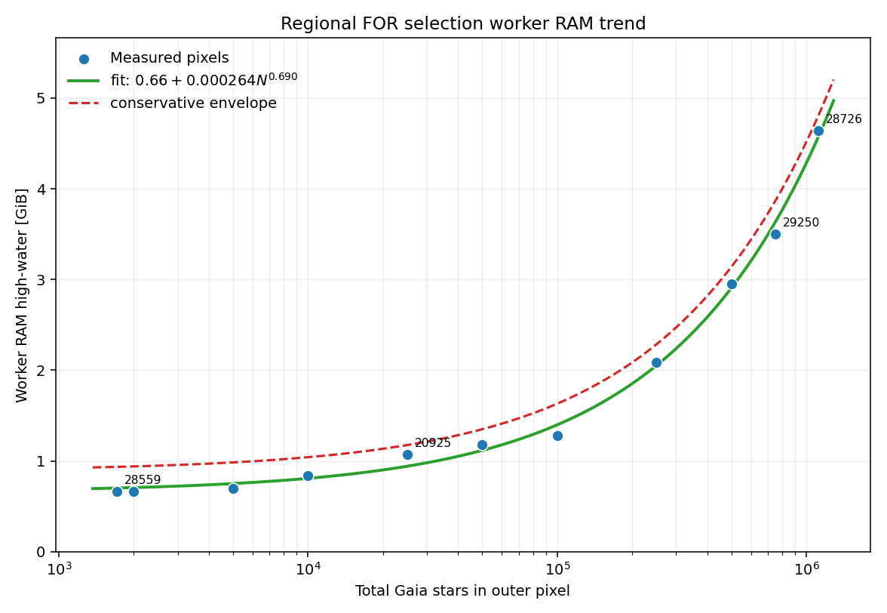

A sublinear power-law fit gives a useful rough worker-RAM trend for scheduling:

```text
worker_ram_gib = 0.66 + 0.000264 * total_gaia_stars^0.690
R^2 = 0.996
```

A conservative upper-envelope form that covers this sweep is:

```text
estimated_worker_ram_gib = 0.89 + 0.000264 * total_gaia_stars^0.690
```

For schedule-overlap simulation, the fixed `0.89 GiB` term is not stacked as
pixel work. The measured worker-trade fit supplies the total-RAM overhead below,
and only the star-dependent term is treated as active worker memory:

```text
active_worker_ram_gib = 0.000264 * total_gaia_stars^0.690
```

For GPU workers, add about `1.05 GiB` of GPU-driver RAM per active worker in
this local PyTorch/MPS environment.

The fitted coefficients are local calibration values, not machine-independent
constants. For scheduling, the important portable signal is relative ordering:
high-`star_count` pixels should still be treated as heavy pixels even if another
machine shifts the absolute RAM curve up or down. The parent total-RAM guard and
observed worker RSS remain the authority for machine-specific limits.

### Runtime Estimate

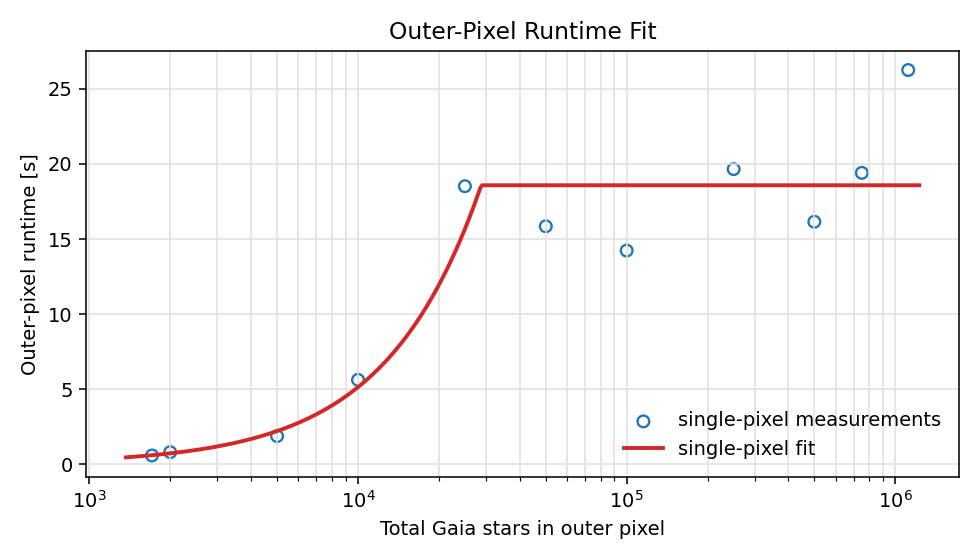

Outer-pixel runtime is estimated with a piecewise fit. A power law is fit to
the pre-saturation points below `25,000` total stars, and the estimate is then
capped at the saturation mean computed from the `25,000`-star point and the
denser points:

```text
outer_pixel_seconds =
    min(0.5 * 6.86e-05 * total_gaia_stars^1.22, 18.6)
```

The `0.5` factor comes from comparing isolated single-pixel timings with
neighbour-ordered regional worker plans, where adjacent pixels reuse Gaia cache
state and warm model runtime state. It is used only as an ordering proxy for
staggering heavy regions; observed runtime remains the authority for throughput
estimates. RAM is not scaled because it behaves like a high-water quantity and
already matches the real run well.

The regional cap starts at about `50.8k` total stars.

RAM starts with the star-dependent RAM fit plus per-active-worker GPU overhead.
The GPU worker-trade measurements provide the additive total-RAM overhead from a
straight-line fit to measured total RAM versus worker count:

```text
measured_total_ram_gib = 12.13605 + 1.35087 * workers
total_ram_gib =
    12.13605
    + active_worker_ram_gib
    + active_gpu_overhead_gib
```

The `12.13605 GiB` overhead is a local empirical planning correction, not a
physical model. The GPU-driver term comes from measured MPS driver telemetry,
while star-count structure remains responsible for scheduling pressure.

The base runtime model is calibrated as a one-worker outer-pixel estimate. For
multi-worker GPU simulations, the simulator multiplies each outer-pixel runtime
by the per-worker throughput correction measured in the worker trade study:

```text
throughput_per_worker(w) = -0.00208 * w + 0.07455
runtime_scale(w) =
    throughput_per_worker(1) / throughput_per_worker(w)
```

## 2026-04-18 Phase 14 Worker Trade Study

This study compares CPU prediction with more workers against GPU prediction
with fewer workers after retaining dense ladder inference batches. The sample
contains `60` individual outer pixels: `12` pixels from each total-star-count
bin (`1,000-5,000`, `5,000-25,000`, `25,000-100,000`,
`100,000-300,000`, and `>300,000`), including the worst loaded Gaia pixel,
`28726`.

Common setup:

- Sample: `/Volumes/Data/Galaxy/aosky/benchmark-runs/phase14-worker-trade-study-pixels.ecsv`
- CPU run: `/Volumes/Data/Galaxy/aosky/benchmark-runs/ao-sky-traversal-baseline-20260418-212226/summary.csv`
- GPU run: `/Volumes/Data/Galaxy/aosky/benchmark-runs/ao-sky-traversal-baseline-20260418-215820/summary.csv`
- Parent memory limit: `26 GiB`
- Inference row buffer: `25000`
- Inference batches: dense ladder from `1000` to `25000` in `1000`-row steps
- Cache clearing: no routine `torch.mps.empty_cache()` calls

`Process RAM` is the sampled high-water RSS of the parent process and active
worker process tree. `GPU RAM` is the worker-summed MPS driver allocation.
`Total RAM` is `Process RAM + GPU RAM`, the planning value that best matches
observed whole-system memory pressure on this machine.

CPU results:

| Workers | Wall | Pixels/s/Worker | Process RAM | GPU RAM | Total RAM | Resolved Inference | Averaged Inference |
| ---: | ---: | ---: | ---: | ---: | ---: | ---: | ---: |
| `3` | `504.97 s` | `0.040` | `12.3 GiB` | `0.0 GiB` | `12.3 GiB` | `472.9 s` | `10.1 s` |
| `4` | `365.21 s` | `0.041` | `16.7 GiB` | `0.0 GiB` | `16.7 GiB` | `529.1 s` | `10.8 s` |
| `6` | `298.80 s` | `0.033` | `17.5 GiB` | `0.0 GiB` | `17.5 GiB` | `567.5 s` | `11.5 s` |
| `8` | `228.07 s` | `0.033` | `18.4 GiB` | `0.0 GiB` | `18.4 GiB` | `678.0 s` | `13.2 s` |
| `10` | `210.17 s` | `0.029` | `18.7 GiB` | `0.0 GiB` | `18.7 GiB` | `725.5 s` | `14.0 s` |

GPU results:

| Workers | Wall | Pixels/s/Worker | Process RAM | GPU RAM | Total RAM | Resolved Inference | Averaged Inference |
| ---: | ---: | ---: | ---: | ---: | ---: | ---: | ---: |
| `3` | `315.89 s` | `0.063` | `12.1 GiB` | `3.1 GiB` | `15.2 GiB` | `59.6 s` | `1.8 s` |
| `4` | `219.97 s` | `0.068` | `14.6 GiB` | `4.2 GiB` | `18.8 GiB` | `62.9 s` | `1.9 s` |
| `5` | `169.35 s` | `0.071` | `13.8 GiB` | `5.2 GiB` | `19.1 GiB` | `67.1 s` | `2.1 s` |
| `6` | `168.87 s` | `0.059` | `13.8 GiB` | `6.3 GiB` | `20.1 GiB` | `67.3 s` | `2.2 s` |
| `7` | `141.69 s` | `0.060` | `13.7 GiB` | `7.3 GiB` | `21.0 GiB` | `68.0 s` | `2.4 s` |
| `8` | `127.13 s` | `0.059` | `14.8 GiB` | `8.4 GiB` | `23.2 GiB` | `78.0 s` | `2.5 s` |
| `9` | `124.61 s` | `0.054` | `14.8 GiB` | `9.4 GiB` | `24.2 GiB` | `79.1 s` | `2.7 s` |

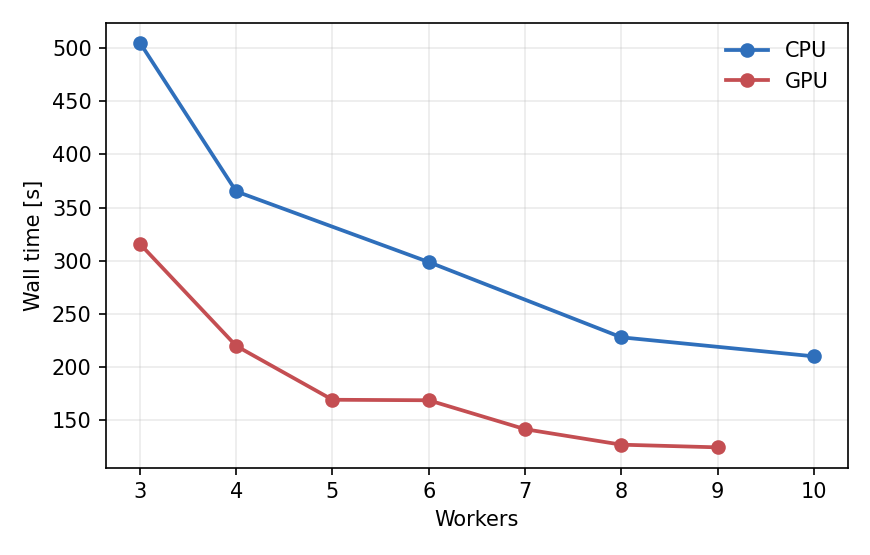

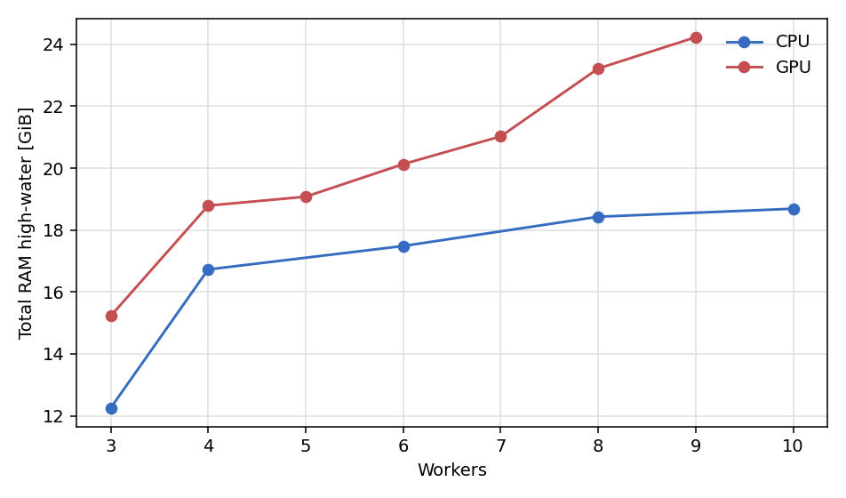

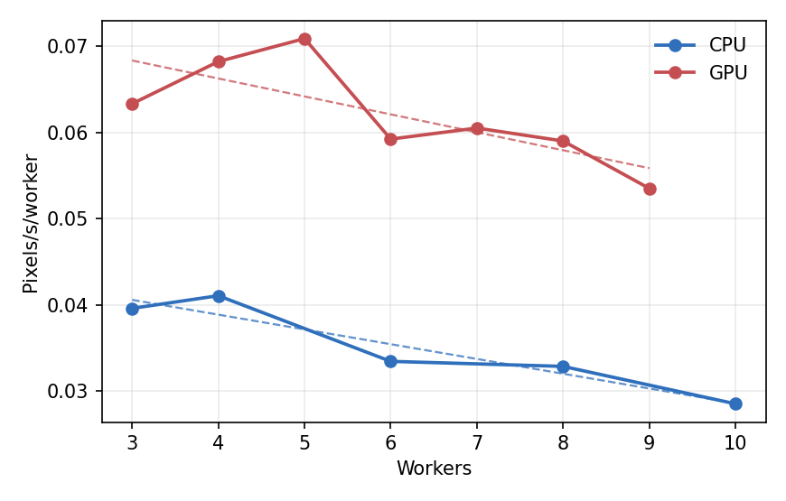

Linear per-worker throughput fits over this sample:

- CPU: `pixels/s/worker = -0.00171 * workers + 0.04572`
- GPU: `pixels/s/worker = -0.00208 * workers + 0.07455`

Interpretation:

- GPU outperforms CPU as expected, at the cost of more RAM, so prefer GPU when
  memory headroom is available.
- GPU speed improvement starts to stall after `8` workers on this sample.
- Throughput decreases with multiprocessing overhead as expected; runtime
  estimates should account for this rather than assuming linear worker scaling.
- Conclusion: use GPU with `9` workers and include measured throughput
  scaling when estimating runtime.

## 2026-04-18 Phase 14 Memory-Aware Regional Pre-Planning

The next scheduling question is whether worker plans can be ordered so high-RAM
pixels are unlikely to peak at the same time while still preserving neighbour
locality for Gaia-cache reuse. The current regional scheduler builds static
worker plans: each worker stays busy until its assigned regional plan is done,
but workers do not steal unfinished pixels from each other. This makes the
up-front plan order important.

The Galactic-latitude-aware pre-planner assigns `|b| <= 15 deg` regions to a
low-latitude worker lane and higher-latitude regions to a second lane. The
worker split is selected by simulation: for each candidate worker count, sweep
the low-latitude worker count and keep the fastest split that remains under the
configured total-RAM ceiling. Each latitude lane is balanced by estimated
runtime, then ordered by Galactic longitude with staggered worker starts. If the
pending work contains only one latitude lane, all workers are used for that
lane. Neighbour-first ordering is preserved inside each region, and the parent
total-RAM guard remains the final protection.

The simulation is a planning estimate, not the runtime authority. In the real
build, the parent process monitors total RSS across itself and active workers.
When GPU prediction is enabled, it also reserves a measured GPU-driver
high-water allowance per active worker so the guard tracks the same total-RAM
quantity used in the benchmark policy.
When total RAM approaches the configured parent limit, it targets the heaviest
workers first: workers trim Gaia/Torch caches and collect garbage at safe
checkpoints, and under harder pressure can pause before starting another outer
pixel. The aim is to stay below the configured high-water limit even when
Python or Torch memory retention prevents the real curve from following the
simulation exactly.

### Original Simulation

A runtime simulation is available in `scripts/simulate_regional_schedule_memory.py`.
The script treats each outer pixel as holding its estimated peak worker RAM for
the pixel's full estimated runtime. The runtime estimate uses the piecewise
star-count fit shown above. The RAM plots stack active workers by current memory
rank, so the top band is the heaviest active worker at that time rather than a
fixed worker ID. The neutral grey band is the measured total-RAM overhead;
colored bands are active star-count RAM plus GPU-driver overhead.

The RAM overhead is calibrated by comparing the schedule simulation against the
real GPU worker-trade study:

```text
overhead_needed = real_total_ram - simulated_active_ram
simulated_active_ram = simulated_worker_ram + simulated_gpu_ram
```

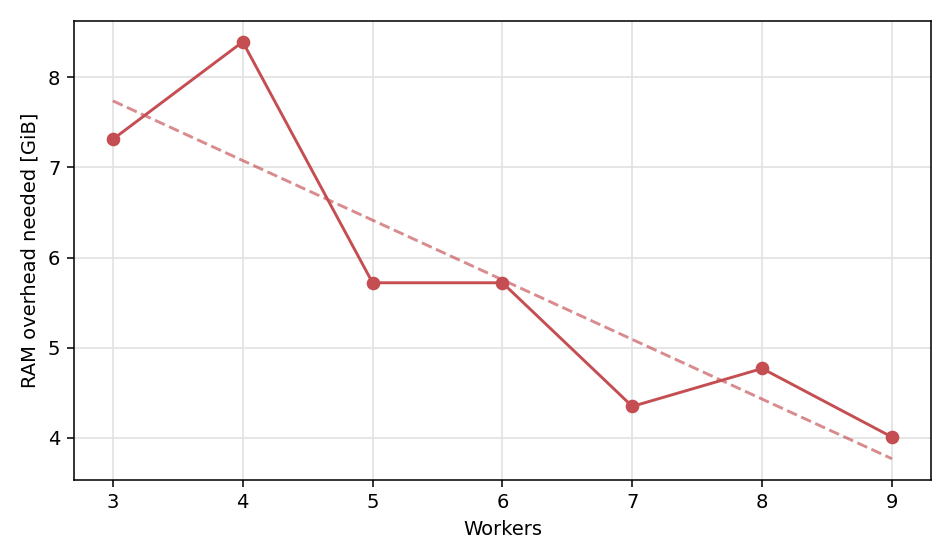

Current linear overhead fit:

```text
overhead_gib = 9.71929 - 0.66107 * workers
```

| Workers | Real Total | Sim Worker | Sim GPU | Sim Active | Overhead Needed | Overhead Fit |
| ---: | ---: | ---: | ---: | ---: | ---: | ---: |
| `3` | `15.22 GiB` | `4.76 GiB` | `3.15 GiB` | `7.91 GiB` | `7.31 GiB` | `7.74 GiB` |
| `4` | `18.79 GiB` | `6.19 GiB` | `4.20 GiB` | `10.39 GiB` | `8.39 GiB` | `7.07 GiB` |
| `5` | `19.08 GiB` | `8.11 GiB` | `5.25 GiB` | `13.36 GiB` | `5.72 GiB` | `6.41 GiB` |
| `6` | `20.13 GiB` | `8.11 GiB` | `6.30 GiB` | `14.41 GiB` | `5.72 GiB` | `5.75 GiB` |
| `7` | `21.03 GiB` | `9.32 GiB` | `7.35 GiB` | `16.67 GiB` | `4.35 GiB` | `5.09 GiB` |
| `8` | `23.22 GiB` | `10.05 GiB` | `8.40 GiB` | `18.45 GiB` | `4.77 GiB` | `4.43 GiB` |
| `9` | `24.23 GiB` | `10.77 GiB` | `9.45 GiB` | `20.22 GiB` | `4.01 GiB` | `3.77 GiB` |

The `4`-worker point is the largest tension in the fit. A linear overhead is
about as accurate as the piecewise alternative on the existing worker-trade
data and is easier to interpret. GPU memory is modeled as a configured-worker
high-water term, not an active-worker term, matching the MPS driver telemetry
used in the worker-trade measurements.

The decreasing overhead term should be interpreted as a calibration residual,
not as a physical memory component that truly shrinks with more workers. It
likely reflects several effects folded together: simulated worker RAM assumes
each active pixel holds its peak RAM for the full pixel runtime, high estimated
pixel peaks may not occur simultaneously in the real run, GPU RAM grows with
configured worker count, and process-side RAM appears to plateau once enough
workers are active. In short, the active RAM model over-scales with worker count
relative to the measured process-side high-water, and the fitted overhead
absorbs that mismatch.

The 288-pixel validation case uses the same fixed sample as the inference-shape
benchmarks:

```bash
./.conda/bin/python scripts/simulate_regional_schedule_memory.py \
  /Volumes/Data/Galaxy/aosky/gnao-baseline/v1 \
  --sample-pixels /Volumes/Data/Galaxy/aosky/benchmark-runs/ao-sky-compression-sweep-bench-20260416-212643/sample-pixels.ecsv \
  --workers 3 \
  --throughput-device gpu \
  --per-worker-gpu-overhead-gib 1.05 \
  --plot-output docs/assets/benchmarking/0.1.0/regional-schedule-ram-simulation-288.png
```

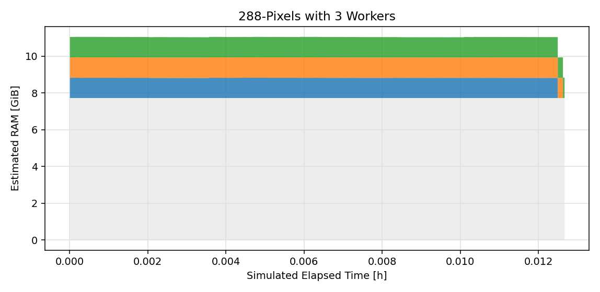

Comparison to the real dense-ladder GPU run on the same sample:

| Case | Pixels | Elapsed | Worker RAM | GPU RAM | RAM Overhead | Total RAM |
| --- | ---: | ---: | ---: | ---: | ---: | ---: |
| Simulation | `288` | `45.59 s` | `0.18 GiB` | `3.15 GiB` | `7.74 GiB` | `11.07 GiB` |
| Real run | `288` | `46.90 s` | `2.8 GiB` | `3.1 GiB` | n/a | `6.0 GiB` |

The 288-pixel real RAM row predates parent-level total-RAM high-water sampling,
so it is useful for runtime comparison but not for calibrating total RAM. The
worker-trade table below uses the corrected parent-level RAM measurement.

As a second cross-check, the simulator was run on the exact `60`-pixel worker
trade-study sample and compared against the real GPU worker-trade runs:

| Workers | Real Wall | Sim Wall | Time Sim / Real | Sim Total RAM | Real Total RAM | RAM Sim / Real |
| ---: | ---: | ---: | ---: | ---: | ---: | ---: |
| `3` | `315.89 s` | `333.31 s` | `1.06x` | `15.65 GiB` | `15.2 GiB` | `1.03x` |
| `4` | `219.97 s` | `231.74 s` | `1.05x` | `17.47 GiB` | `18.8 GiB` | `0.93x` |
| `5` | `169.35 s` | `179.96 s` | `1.06x` | `19.77 GiB` | `19.1 GiB` | `1.04x` |
| `6` | `168.87 s` | `185.99 s` | `1.10x` | `20.16 GiB` | `20.1 GiB` | `1.00x` |
| `7` | `141.69 s` | `153.62 s` | `1.08x` | `21.77 GiB` | `21.0 GiB` | `1.04x` |
| `8` | `127.13 s` | `133.90 s` | `1.05x` | `22.88 GiB` | `23.2 GiB` | `0.99x` |
| `9` | `124.61 s` | `138.89 s` | `1.11x` | `23.99 GiB` | `24.2 GiB` | `0.99x` |

This cross-check shows that the simulator is conservative on wall time by about
`5-11%` while preserving the worker-count shape. With the calibrated overhead and
configured-worker GPU high-water term, simulated RAM is within about `-7%` to
`+4%` of the corrected real total-RAM high-water over this sample.
The real worker-trade runs show that `9` workers is only about `2.0%` faster
than `8` workers on the fixed sample, but the full-sky simulation still selects
`9` workers when the configured total-RAM ceiling is `26 GiB`.

Interpretation:

- Total Gaia star count is a useful cheap proxy for worker RAM, so it can drive
  memory-aware pre-planning even though the fitted curve is approximate.
- Conclusion: pre-planning can use star count plus Galactic-latitude phasing to
  stagger high-memory pixels while preserving regional/neighbour ordering for
  cache locality.

### Worker Optimization

Full-sky GPU worker-count simulations with per-worker throughput correction.
Each cell is elapsed time / total RAM. Cells marked `*` exceed the configured
`26 GiB` total-RAM ceiling.

| Workers | Low `1` | Low `2` | Low `3` | Low `4` | Low `5` | Low `6` | Low `7` | Low `8` |
| ---: | ---: | ---: | ---: | ---: | ---: | ---: | ---: | ---: |
| `4` | `57.0 h / 18.8 GiB` | `28.5 h / 18.5 GiB` | `26.5 h / 17.9 GiB` | - | - | - | - | - |
| `5` | `58.3 h / 18.4 GiB` | `29.2 h / 17.4 GiB` | `19.4 h / 20.3 GiB` | `27.9 h / 19.4 GiB` | - | - | - | - |
| `6` | `60.3 h / 19.8 GiB` | `30.1 h / 19.4 GiB` | `20.1 h / 19.5 GiB` | `15.1 h / 19.7 GiB` | `28.9 h / 20.4 GiB` | - | - | - |
| `7` | `62.4 h / 19.9 GiB` | `31.2 h / 18.6 GiB` | `20.8 h / 21.5 GiB` | `15.6 h / 20.8 GiB` | `14.9 h / 21.8 GiB` | `29.9 h / 22.0 GiB` | - | - |
| `8` | `64.6 h / 19.7 GiB` | `32.3 h / 19.4 GiB` | `21.5 h / 20.4 GiB` | `16.2 h / 20.4 GiB` | `13.0 h / 21.9 GiB` | `15.5 h / 23.0 GiB` | `30.9 h / 24.5 GiB` | - |
| `9` | `67.0 h / 21.3 GiB` | `33.5 h / 21.7 GiB` | `22.3 h / 21.2 GiB` | `16.8 h / 22.5 GiB` | `13.4 h / 23.1 GiB` | `11.2 h / 23.7 GiB` | `16.0 h / 26.6 GiB*` | `32.1 h / 25.6 GiB` |

The selected full-sky simulation is the fastest split under the configured total-RAM ceiling: `9` GPU workers with `6` low-latitude workers.

```bash
./.conda/bin/python scripts/simulate_regional_schedule_memory.py \
  /Volumes/Data/Galaxy/aosky/gnao-baseline/v1 \
  --schedule-full-sky \
  --workers 9 \
  --galactic-low-latitude-workers 6 \
  --scheduler static \
  --throughput-device gpu \
  --per-worker-gpu-overhead-gib 1.05 \
  --memory-limit-mb 26624 \
  --trim-fraction 0.80 \
  --pause-fraction 0.90 \
  --plot-output docs/assets/benchmarking/0.1.0/regional-schedule-ram-simulation-full-sky.png \
  --throughput-plot-output docs/assets/benchmarking/0.1.0/regional-schedule-throughput-simulation-full-sky.png
```

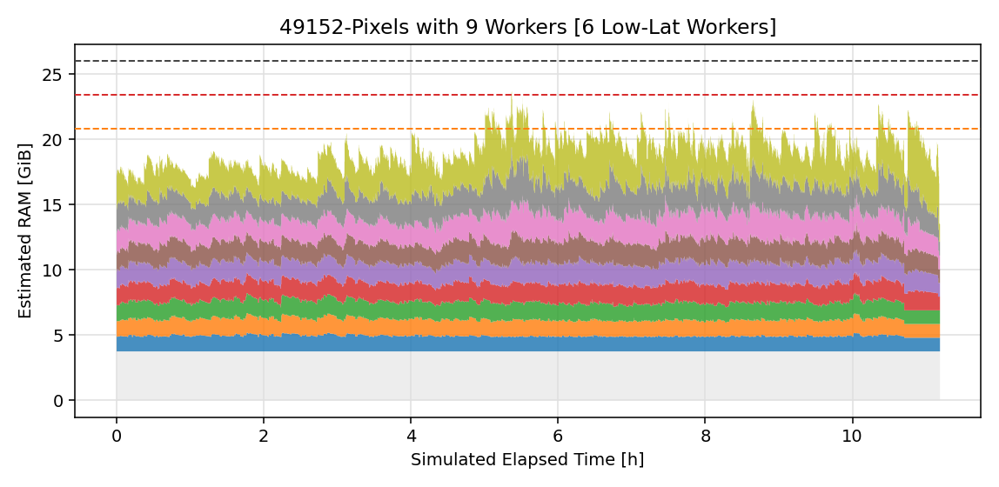

The black dashed line marks `build.memory_limit_mb = 26624`; the orange and
red dashed lines mark the overnight trim and pause entry thresholds.

The matching cumulative completion plot shows simulated pixel throughput over
time. The slope of the dark cumulative curve is the instantaneous simulated
throughput; the dashed black line connects `(0, 0)` to the final simulated
completion point, and its annotated slope is the end-to-end average throughput.

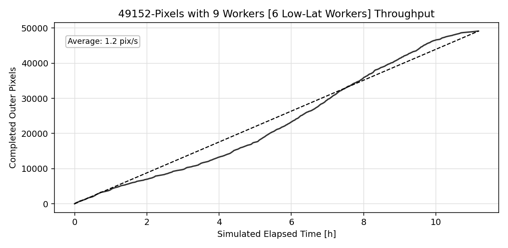

Interpretation:

- With a RAM ceiling of 26 GiB, the simulation suggests the entire sky can be processed in about 11.2 hours.
- Conclusion: use `9` GPU workers with `6` low-latitude workers.

### Retained-Policy Smoke

A short real-data smoke was run after encoding the retained defaults in
`ao-sky.yaml` and the code defaults. This used the first `12` pixels from the
fixed sample, GPU prediction for both model families, dense inference-shape
ladders from `1000..25000`, no routine cache clearing, `9` workers, and a
`26624 MiB` total-RAM guard.

Benchmark root:

`/Volumes/Data/Galaxy/aosky/benchmark-runs/ao-sky-traversal-baseline-20260419-000525`

| Pixels | Workers | Wall | Total RAM | GPU Driver RAM | Cache Clear | Resolved Inference | Averaged Inference |
| ---: | ---: | ---: | ---: | ---: | --- | ---: | ---: |
| `12` | `9` | `9.09 s` | `2.09 GiB` | `1.05 GiB` | `never` | `1.66 s` | `0.33 s` |

Interpretation:

- The retained defaults are active in a real build path: GPU prediction,
  dense inference shapes, and no routine cache clear all appeared in telemetry.
- The smoke completed without memory-pressure failure and stayed far below the
  `26 GiB` guard on this small sample.

## 2026-04-19 Phase 14B First Full-Sky Runtime Evidence

The first production `v1` full-sky attempt was started with the retained Phase
14 policy: GPU prediction, dense inference-shape control, `9` workers, and a
`26624 MiB` parent total-RAM ceiling. The run was stopped deliberately before
Phase 15 discussion; no outer pixels had failed, and stale `running` rows are
repaired to `pending` on restart.

### v1 Run 1: Workers `9`/`6`

Measured state at stop:

| Policy | Window Elapsed | Completed | Throughput | Normal | Trim | Pause | Peak Total RAM | Remaining ETA |
| --- | ---: | ---: | ---: | ---: | ---: | ---: | ---: | ---: |
| `9/6` | `6.84 h` | `19,781` | `0.80 pix/s` | `2` | `1,331` | `1,088` | `25.48 GiB` | `10.2 h` |

Measured RAM and throughput plots use the `9`/`6` run window in `build.log`:

```bash
./.conda/bin/python scripts/plot_build_memory_timeline.py \
  /Volumes/Data/Galaxy/aosky/gnao-baseline/v1/build.log \
  --since 2026-04-19T04:49:25.703372+00:00 \
  --until 2026-04-19T18:59:50.087984+00:00 \
  --output docs/assets/benchmarking/0.1.0/phase14b-9w6-measured-ram.png \
  --throughput-output docs/assets/benchmarking/0.1.0/phase14b-9w6-measured-throughput.png
```

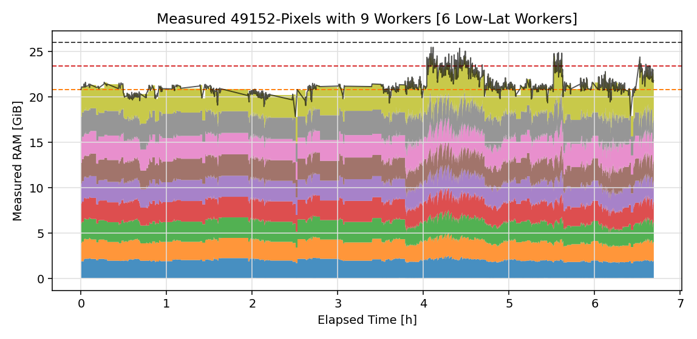

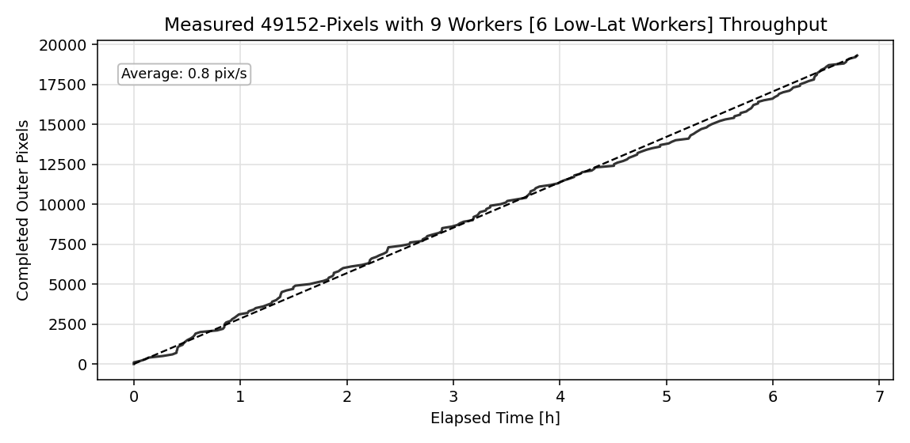

The `9`/`6` throughput plot is reconstructed from periodic progress/profile
samples because this first run log predates per-pixel `outer_pixel_done`
records.

Interpretation:

- The `9`/`6` policy was too aggressive for the configured memory ceiling: only
  `2` memory samples were normal, while `1,331` were in trim and `1,088` were
  in pause.
- Sustained trim/pause made the hard memory ceiling the operating point, which
  is not desirable because trim is expensive and pause is more expensive.
- Conclusion: the next run should reduce memory pressure by testing `8`
  workers with `5` low-latitude workers, while raising the guard bands to
  trim at `85%`/release at `80%` and pause at `95%`/release at `90%` so trim is
  no longer the normal operating state.

### v1 Run 2: Workers `8`/`5`

Measured state at stop:

| Policy | Window Elapsed | Completed | Throughput | Normal | Trim | Pause | Peak Total RAM | Remaining ETA |
| --- | ---: | ---: | ---: | ---: | ---: | ---: | ---: | ---: |
| `8/5` | `2.66 h` | `8,372` | `0.87 pix/s` | `160` | `5` | `0` | `22.3 GiB` | `6.7 h` |

Measured RAM and throughput plots use the `8`/`5` run window in `build.log`:

```bash
./.conda/bin/python scripts/plot_build_memory_timeline.py \
  /Volumes/Data/Galaxy/aosky/gnao-baseline/v1/build.log \
  --since 2026-04-19T18:59:50.087984+00:00 \
  --until 2026-04-19T21:39:37+00:00 \
  --output docs/assets/benchmarking/0.1.0/phase14b-8w5-measured-ram.png \
  --throughput-output docs/assets/benchmarking/0.1.0/phase14b-8w5-measured-throughput.png
```

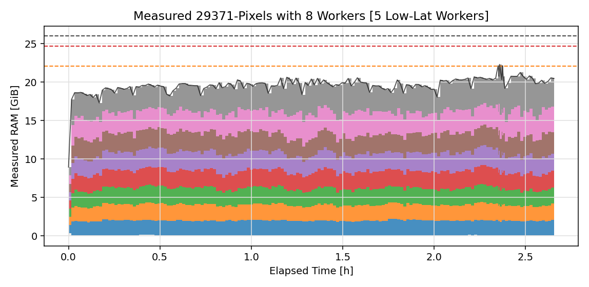


Interpretation:

- The `8`/`5` run stayed mostly below the trim threshold: `160` samples were
  normal, `5` were in trim, and none were in pause.
- Throughput improved to `0.87 pix/s` despite using one fewer worker than the
  `9`/`6` run, confirming that reduced memory pressure can beat nominal
  parallelism.
- Conclusion: `8`/`5` is the current best measured policy, but the next
  matched-duration check should test `7` workers with `4` low-latitude workers.
  The better of `8`/`5` and `7`/`4` should be retained for continuing the full
  build.

### v1 Run 3: Workers `8`/`2`

Measured state at completion:

| Policy | Window Elapsed | Completed | Throughput | Normal | Trim | Pause | Peak Total RAM | Remaining ETA |
| --- | ---: | ---: | ---: | ---: | ---: | ---: | ---: | ---: |
| `8/2` | `3.75 h` | `21,029` | `1.56 pix/s` | `224` | `0` | `0` | `20.67 GiB` | `0 h` |

Measured RAM and throughput plots use the final `8`/`2` run window in
`build.log`:

```bash
./.conda/bin/python scripts/plot_build_memory_timeline.py \
  /Volumes/Data/Galaxy/aosky/gnao-baseline/v1/build.log \
  --since 2026-04-20T05:16:25.554548+00:00 \
  --until 2026-04-20T09:01:38.859890+00:00 \
  --output docs/assets/benchmarking/0.1.0/phase14b-8w2-measured-ram.png \
  --throughput-output docs/assets/benchmarking/0.1.0/phase14b-8w2-measured-throughput.png
```

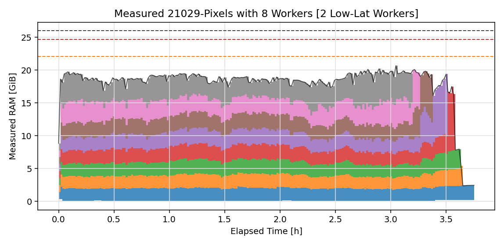

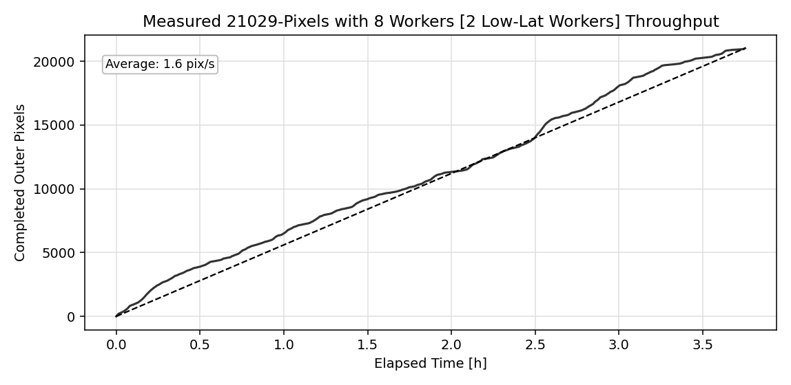

Interpretation:

- The `8`/`2` restart completed the remaining `21,029` outer pixels and
  finished traversal with `failed=0`.
- Memory stayed entirely below the trim threshold: all `224` memory samples
  were normal, with no trim or pause commands.
- Throughput increased to `1.56 pix/s`, but this window was mostly the
  remaining high-latitude and lower-density work, so it should not be compared
  directly against the earlier mixed-density windows as a full-sky policy
  estimate.
- Conclusion: for the remainder left after the first two runs, reducing the
  low-latitude worker allocation to `2` gave enough memory headroom to finish
  without pressure while keeping all active work moving quickly.

### Real-Run Comparison

The direct measured comparison uses elapsed time from the start of each run
window. The `9`/`6` window is the first full-sky attempt; the `8`/`5` window is
the lower-pressure restart; the `8`/`2` window is the final completion run.
These plots compare live behavior without invoking the simulator.

```bash
./.conda/bin/python scripts/plot_build_run_comparison.py \
  /Volumes/Data/Galaxy/aosky/gnao-baseline/v1/build.log \
  --run "9/6,2026-04-19T04:49:25.703372+00:00,2026-04-19T18:59:50.087984+00:00" \
  --run "8/5,2026-04-19T18:59:50.087984+00:00,2026-04-19T21:39:37+00:00" \
  --run "8/2,2026-04-20T05:16:25.554548+00:00,2026-04-20T09:01:38.859890+00:00" \
  --ram-output docs/assets/benchmarking/0.1.0/phase14b-real-run-ram-comparison.png \
  --throughput-output docs/assets/benchmarking/0.1.0/phase14b-real-run-throughput-comparison.png
```

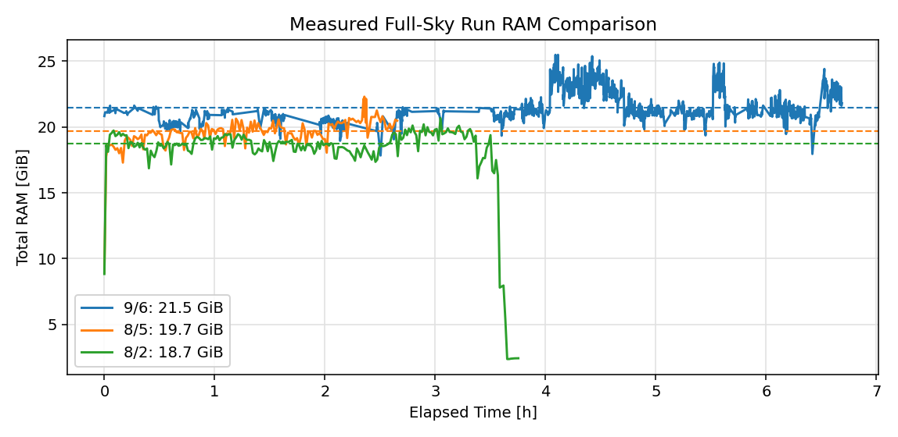

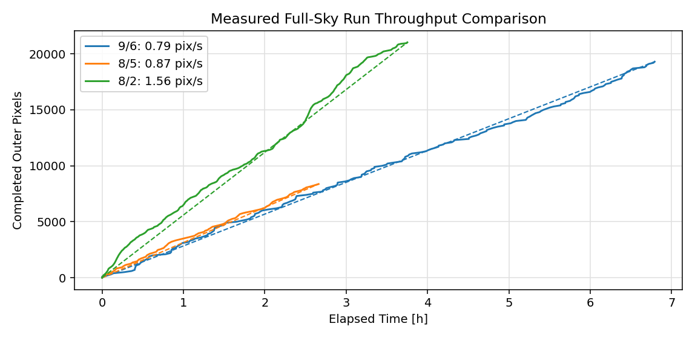

Interpretation:

- The `9`/`6` run reached and sustained higher total RAM, including a long
  period near the trim/pause region.
- The `8`/`5` run stayed substantially lower in RAM and completed pixels at a
  steeper live rate over the measured window.
- The `8`/`2` run had the lowest RAM pressure and highest measured throughput,
  but it processed the final remaining work rather than a representative
  full-sky mix.
- The static scheduler evidence is sufficient for the completed `v1` build,
  but the windows also motivate the Phase 14C dynamic scheduler work: the best
  worker split depends strongly on the density mix left in the queue.

### Updated Simulation (Based on Run 2: 8/5)

The following script regenerates the plots in this section using the
information from the measured `8`/`5` window, including the runtime model,
stochastic runtime realization, RAM cloud, high-water plateau fit, and leaky
current-RSS and total-RAM models.

```bash
./.conda/bin/python scripts/plot_build_outer_pixel_runtime_ram.py \
  /Volumes/Data/Galaxy/aosky/gnao-baseline/v1/build.log \
  --since 2026-04-19T18:59:50.087984+00:00 \
  --until 2026-04-19T21:39:37+00:00 \
  --output-dir docs/assets/benchmarking/0.1.0 \
  --prefix phase14b-8w5
```

#### Runtime

The `8`/`5` window includes per-pixel `outer_pixel_start` and
`outer_pixel_done` records, so outer-pixel runtime can be compared directly
against the loaded Gaia star count.

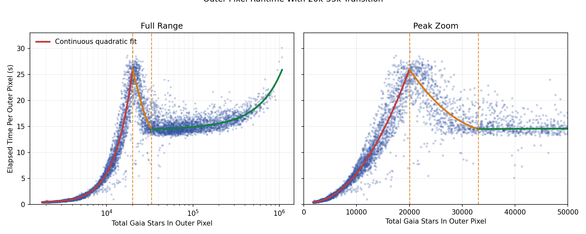

Interpretation: runtime appears to move from a sparse regime into a transition
region where some of the outer pixel is routed through regional FOR-optimized
NGS selection, then flattens once the selector dominates and caps the dense
field candidate work. The retained scheduling runtime model is fit to
log-spaced binned medians from the `8`/`5` run using fixed breakpoints at
`20k` and `33k` Gaia stars, with quadratic branches in all three regimes and
continuity forced at both joins. This may be worker-count dependent, so use it
as an `8`-worker model while developing the next scheduler.

With `u = total_gaia_stars / 1000`, the model is:

```text
t = 0.572 - 0.183 u + 0.0725 u^2,                         u <= 20
t = 25.920 - 1.457 (u - 20) + 0.0445 (u - 20)^2,      20 < u <= 33
t = 14.496 + 0.00560 (u - 33) + 0.00000504 (u - 33)^2,      u > 33
```

The stochastic runtime layer is also tied to the same three intervals. It uses
additive Student-t residuals with `7` degrees of freedom, smooth fitted
scatter in the sparse and dense intervals, one scatter value in the transition
interval, and a `28 s` cap applied only to sparse and transition realized
runtimes:

```text
t_realized = max(0.1, t_model + noise)
t_realized = min(28.0, t_realized) for sparse and transition pixels only

sparse:      noise ~ t_7(mu=-0.007, sigma=sigma_sparse(u))
transition:  noise ~ t_7(mu=-0.250, sigma=3.001)
dense:       noise ~ t_7(mu= 0.002, sigma=sigma_dense(u))

log sigma_sparse(u) = -5.044 (u / 20)^2 + 10.876 (u / 20) - 4.401
log sigma_dense(u)  =  0.0914 log(u / 33)^2 - 0.328 log(u / 33) + 0.209
```

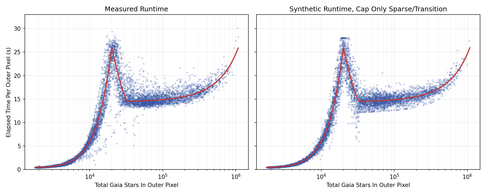

| Dataset | Mean | P50 | P90 | P95 | P99 | Max |
| --- | ---: | ---: | ---: | ---: | ---: | ---: |
| Measured `8`/`5` | `9.09 s` | `8.87 s` | `18.51 s` | `21.86 s` | `26.23 s` | `30.12 s` |
| Synthetic realization | `8.99 s` | `8.95 s` | `17.98 s` | `21.43 s` | `26.34 s` | `28.00 s` |

#### RAM

The same `8`/`5` log window records `peak_rss_mb` when each outer pixel
finishes. This is a worker-process high-water value, not the isolated memory
cost of the individual pixel, so the RAM cloud shows plateaus after each
worker has seen a memory-heavy pixel.

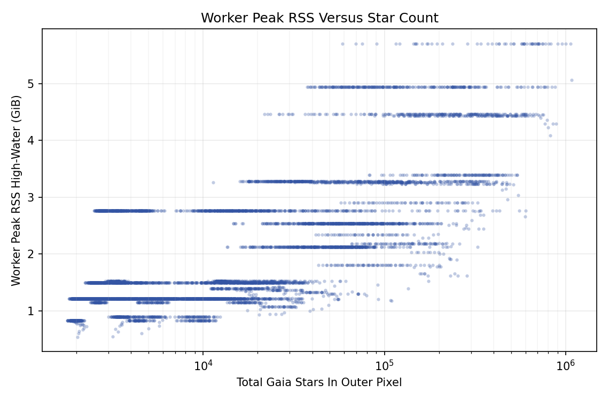

The plateau structure can be made more useful by reconstructing each worker's
completed-pixel sequence over time. For each worker, the largest Gaia star
count seen so far was tracked, and a new point was retained only when that
worker's reported `peak_rss_mb` high-water changed. This converts the previous
RAM cloud into high-water plateau points and fits worker RSS against the
largest pixel that worker has processed. This produced `148` RSS high-water
plateau points. The fit is worker RSS only; it does not include GPU/MPS
reserve, parent process memory, or system overhead.

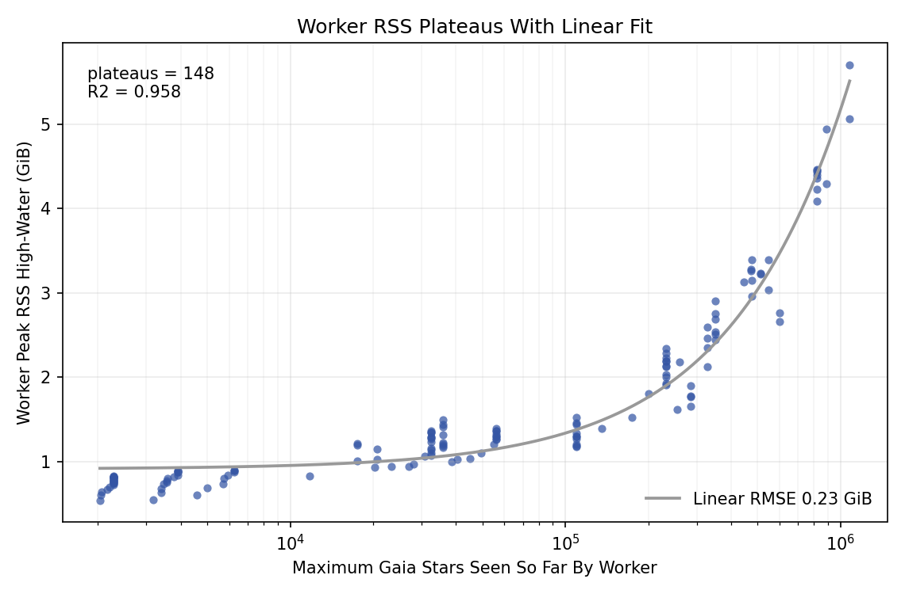

The retained worker-RSS high-water fit is linear in the maximum star count
seen by that worker. This is the deterministic RAM model used for static
scheduling because it estimates the retained high-water memory pressure from
cheap per-pixel star-count metadata:

```text
worker_peak_rss_gib = 0.915 + 4.256e-6 * max_star_count_seen_by_worker
```

The fit has `RMSE = 0.226 GiB` and `R2 = 0.958` over the `8`/`5` plateau
points. Total build RAM must add GPU reserve and parent/system overhead on top
of the summed worker-RSS estimate.

For the real-system simulation, current RSS is modeled by adding memory
release behavior to the deterministic plateau fit. The plateau fit is used as
an instantaneous memory demand from the current pixel's star count, and each
worker carries a leaky RAM state that decays toward a worker-class floor unless
a larger current-pixel demand raises it:

```text
demand_gib = 0.915 + 4.256e-6 * current_pixel_star_count
state(t) = floor_class + (state_previous - floor_class) * exp(-dt / tau_class)
state(t) = max(state(t), demand_gib)
```

The `8`/`5` scheduler has two useful worker classes. Workers `W0-W4` are the
intended low-latitude workers and follow denser star-count trajectories, so
they need a higher floor and slower decay. Workers `W5-W7` are the intended
high-latitude workers and mostly process sparse or moderate pixels, so they
relax faster toward a lower floor.

| Class | Workers | Floor | Tau | RMSE | Bias |
| --- | --- | ---: | ---: | ---: | ---: |
| Low-latitude | `W0-W4` | `1.29 GiB` | `2.5 min` | `0.332 GiB` | `+0.004 GiB` |
| High-latitude | `W5-W7` | `0.93 GiB` | `0.5 min` | `0.173 GiB` | `+0.001 GiB` |

Against current worker-RSS snapshots from the `8`/`5` run, the two-class model
gives `RMSE = 0.283 GiB`, `bias = +0.003 GiB`, and `corr = 0.886`. This is
still worker RSS only.

For dynamic-scheduler simulations, the same two fitted classes are interpreted
as stress-pixel and normal-pixel behavior rather than low-latitude and
high-latitude worker identity. A worker starts at the normal floor, switches to
the stress floor/decay after a stress batch, and switches back to the normal
floor/decay after a normal batch.

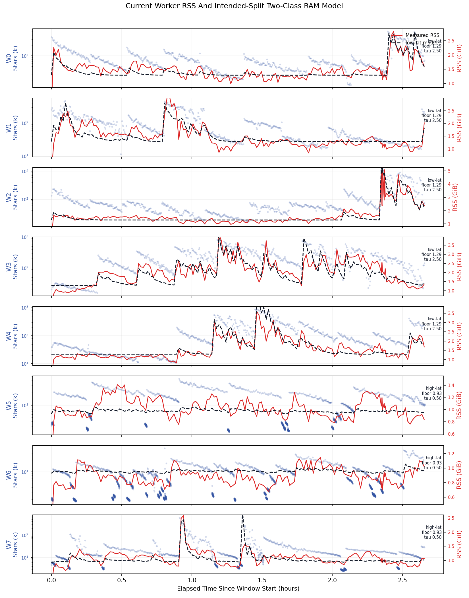

The predicted total-RAM model sums the worker current-RSS model and GPU
reserve:

```text
predicted_total_ram_gib =
    sum(modeled_worker_rss_gib)
    + gpu_reserve_gib
```

For this `8`/`5` run, GPU reserve is `8.40 GiB`, or about `1.05 GiB` per
worker. The total-RAM model reproduces the high-water well but remains only an
approximation to short-timescale memory-release behavior: `RMSE = 1.27 GiB`,
`bias = -0.07 GiB`, and `corr = 0.45`; the measured and predicted peaks are
`22.3 GiB` and `22.4 GiB`.

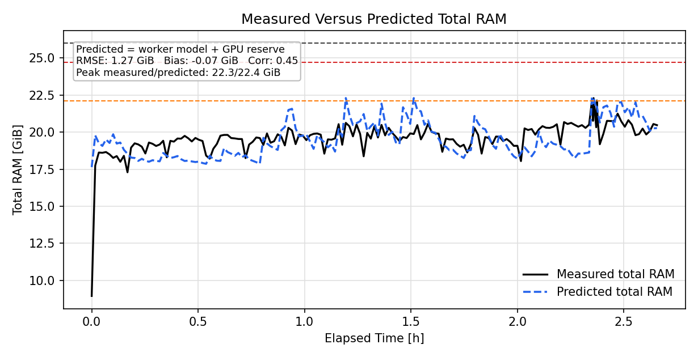

#### Validation

As a first validation check, the stochastic model was used to simulate the full
sky with the production static `9`/`6` scheduler and then compared against the
measured first full-sky run window. The measured run is not a complete full-sky
trajectory, but it is an independent scheduler/run configuration relative to
the `8`/`5` window used to fit the model.

```bash
./.conda/bin/python scripts/simulate_regional_schedule_memory.py \
  /Volumes/Data/Galaxy/aosky/gnao-baseline/v1 \
  --schedule-full-sky \
  --workers 9 \
  --galactic-low-latitude-workers 6 \
  --scheduler static \
  --stochastic \
  --random-seed 23 \
  --throughput-device gpu \
  --per-worker-gpu-overhead-gib 1.05 \
  --memory-limit-mb 26624 \
  --trim-fraction 0.85 \
  --pause-fraction 0.95 \
  --series-output docs/assets/benchmarking/0.1.0/scheduler-comparison/static-9w6low-seed23.npz

./.conda/bin/python scripts/plot_schedule_simulation_comparison.py \
  --series static=docs/assets/benchmarking/0.1.0/scheduler-comparison/static-9w6low-seed23.npz \
  --measured-run "run #1,2026-04-19T04:49:25.703372+00:00,2026-04-19T18:59:50.087984+00:00" \
  --build-log /Volumes/Data/Galaxy/aosky/gnao-baseline/v1/build.log \
  --ram-output docs/assets/benchmarking/0.1.0/scheduler-comparison/stochastic-9w6low-static-vs-run1-ram.png \
  --throughput-output docs/assets/benchmarking/0.1.0/scheduler-comparison/stochastic-9w6low-static-vs-run1-throughput.png \
  --title-prefix "Stochastic 9/6 Static Simulation vs Run #1"
```

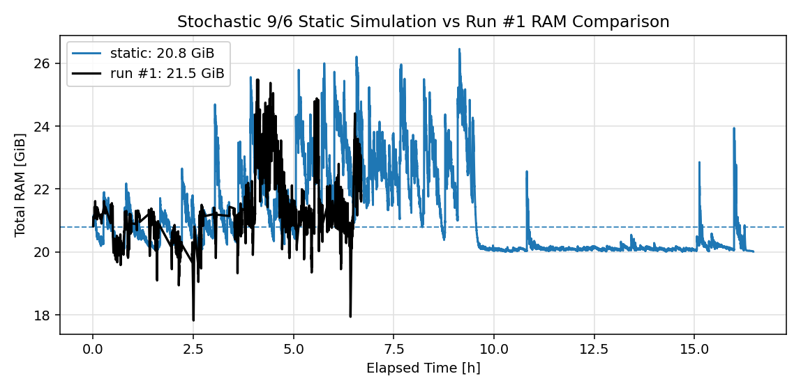

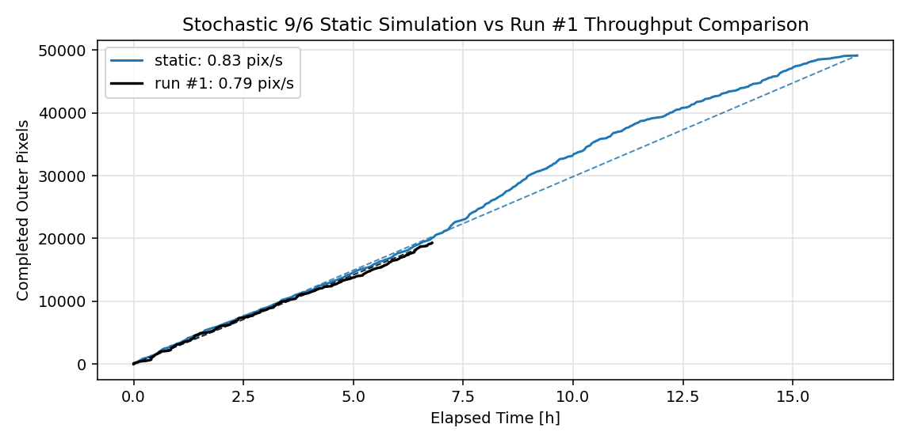

Interpretation:

- The stochastic model gets the `9`/`6` RAM level roughly right: median total
  RAM is `20.8 GiB` simulated versus `21.5 GiB` measured.
- The throughput comparison is also plausible after removing worker-count
  throughput scaling from the calibrated stochastic model: the full-sky
  simulated average is `0.83 pix/s`, while the measured run-window average is
  `0.79 pix/s`.
- This supports using the stochastic model for scheduler comparison, while
  still treating exact wall-clock predictions as approximate.

#### Dynamic Scheduler

The static Galactic-latitude scheduler preassigns full regions to fixed
low-latitude and high-latitude worker pools. This gives good neighbor-cache
locality and a predictable memory profile, but the split is fixed even if the
actual stochastic runtime leaves one pool as the long tail.

The dynamic scheduler now uses Gaia star count directly instead of Galactic
latitude. It converts the trim threshold and worker count into a RAM-stress
star-count threshold using the deterministic per-worker total RAM model:

```text
per_worker_total_gib =
    per_worker_gpu_overhead_gib
    + 0.914584
    + 4.256378e-6 * star_count
```

The GPU term is included in worker RAM for scheduling and plotting; it is not
handled as a separate global reserve in this simulation.

The overall goal is to preserve cache locality and memory continuity when
possible, while spreading workers across the sky when affinity is unavailable.
The scheduler simulator reuses the production dynamic batch planner for stress
classification, batch construction, and stress-worker count; the simulator only
adds the stochastic runtime and current-RSS realization layer used for policy
comparison.
The dynamic scheduler works as follows:

1. **Prep Phase**
   - Estimate Pixel Cost:
     - For every pending outer pixel, estimate:
       - runtime from Gaia star count;
       - worker RAM from Gaia star count.
     - Use the trim-level memory budget to define a RAM-stress threshold.
   - Classify Work:
     - Mark pixels above the threshold as **stress pixels**.
     - Mark all others as **normal pixels**.
   - Determine Stress Concurrency:
     - Sum the estimated runtime in the stress and normal queues.
     - Choose the number of stress workers needed for the stress queue to finish
       on roughly the same wall-clock scale as the full build.
     - Keep at least one normal worker unless no normal work remains.
   - Create Batches:
     - Group stress pixels into smaller spatial batches, currently level-5 HEALPix batches, up to `4` outer pixels.
     - Group normal pixels into larger spatial batches, currently level-3 HEALPix batches, up to `64` outer pixels.

2. **Stress Phase**
   - Applies while stress pixels remain.
   - Uses an `n`-heavy-worker / many-light-workers mix, where `n` is computed
     in the prep phase from the relative stress and normal runtime budgets.
   - Initial RAM Binning:
     - Bin all batches into `num_workers` bins by estimated RAM.
     - Stress pixels naturally fall into the upper bins.
     - Light normal work falls into the lower bins.
   - Select Bin:
     - Assign up to `n` workers from the highest RAM bin that still contains stress work.
     - Assign the remaining workers from the lowest non-empty RAM bin.
     - Up to `n - 1` active stress assignments may bypass the projected-RAM
       guard; additional stress and normal assignments remain subject to it.
     - If a stress-affine worker cannot safely take its preferred guarded
       stress batch, let it search all remaining bins for any RAM-safe batch
       before idling.

3. **Post-Stress Phase**
   - Applies once stress pixels are complete.
   - Uses runtime-balanced assignment over the remaining normal work.
   - Runtime Rebinning:
     - Bin all remaining normal batches into `num_workers` bins by estimated runtime, not RAM.
   - Select Bin:
     - Assign from runtime bins in proportion to remaining runtime.
     - Drain faster bins more often so the build avoids a long tail.

4. **Shared Assignment Rules**
   - Batch Selection:
     - If the worker has connected regional affinity, assign the connected batch with the most similar star count to the worker's previous batch.
     - Otherwise assign the batch farthest from currently active workers.
   - Throttling:
     - Before assigning guarded work to a worker:
       - Project modeled total RAM with the candidate batch included.
       - If it exceeds the trim threshold, try smaller compatible batches from the same scheduling phase.
       - If no compatible batch fits, leave the worker idle but ask it to trim/free memory.
       - Retry scheduling when another worker asks for work (i.e. FIFO queue).
     - Do not idle a worker with stress affinity when it is taking one of the
       allowed unthrottled stress assignments.

The simulator models scheduler-level throttling by first trying a lower-RAM
compatible batch when the preferred assignment would exceed the trim threshold.
Only if no compatible batch fits is the worker left idle. That simulated worker
is trimmed to its current decay floor, then remains in the FIFO queue until the
next scheduling event. Production trim/pause commands remain the runtime safety
layer.

The production implementation follows the same batch classification, stress
concurrency, affinity, and `n - 1` stress-bypass rules. It deliberately keeps
the live RAM model simpler than the simulator: the scheduler projects active
assigned batches only, while the parent process remains responsible for live
total-RAM trim/pause/fail behavior from measured RSS plus GPU reserve.

This simulation does not model prepared Gaia cache hits, filesystem locality,
or parent-worker dispatch overhead. One-pixel dispatch is therefore likely
over-favored in simulated throughput. The level-5 stress and level-3 normal
batching policy is intentionally more production-like: it should improve cache
hit probability and reduce scheduler chatter even though the model only sees
the coarser load-balance cost.

The following comparison uses the same full-sky stochastic realization
(`--random-seed 23`) for all policies:

```bash
./.conda/bin/python scripts/plot_schedule_simulation_comparison.py \
  --series static-9/6=docs/assets/benchmarking/0.1.0/scheduler-comparison/static-9w6low-seed23.npz \
  --series static-8/5=docs/assets/benchmarking/0.1.0/scheduler-comparison/static-8w5low-seed23.npz \
  --series static-7/4=docs/assets/benchmarking/0.1.0/scheduler-comparison/static-7w4low-seed23.npz \
  --series dynamic-9=docs/assets/benchmarking/0.1.0/scheduler-comparison/dynamic-9-ram-bin-seed23.npz \
  --series dynamic-8=docs/assets/benchmarking/0.1.0/scheduler-comparison/dynamic-8-ram-bin-seed23.npz \
  --ram-output docs/assets/benchmarking/0.1.0/scheduler-comparison/stochastic-selected-scheduler-ram-comparison.png \
  --throughput-output docs/assets/benchmarking/0.1.0/scheduler-comparison/stochastic-selected-scheduler-throughput-comparison.png \
  --title-prefix "Stochastic Scheduler Policy Simulation"
```

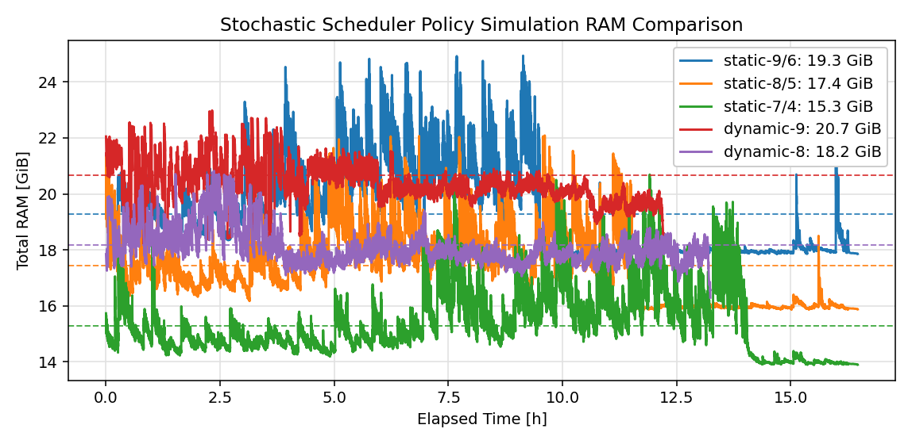

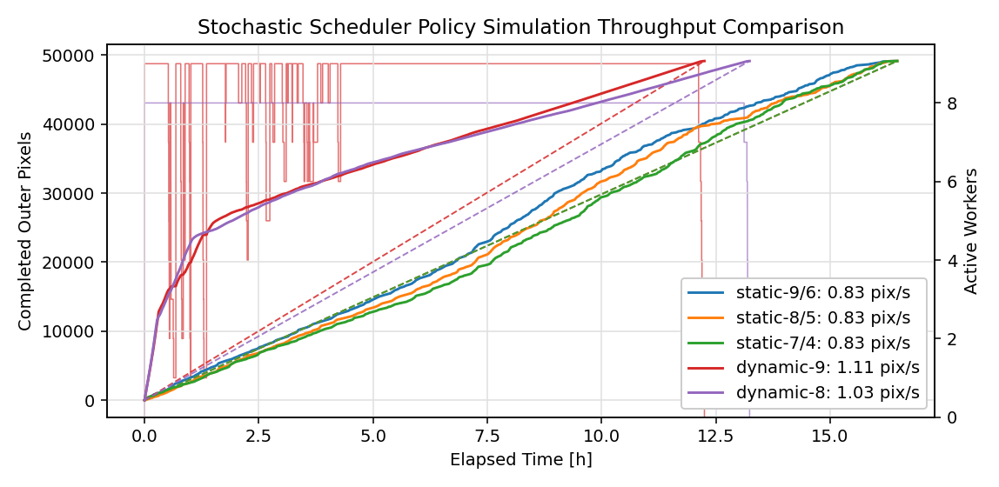

| Policy | Simulated Throughput | Median RAM | Peak RAM |
| --- | ---: | ---: | ---: |
| Static `9/6` | `0.83 pix/s` | `19.3 GiB` | `24.9 GiB` |
| Static `8/5` | `0.83 pix/s` | `17.4 GiB` | `22.1 GiB` |
| Static `7/4` | `0.83 pix/s` | `15.3 GiB` | `20.7 GiB` |
| Dynamic `9` | `1.11 pix/s` | `20.7 GiB` | `23.0 GiB` |
| Dynamic `8` | `1.03 pix/s` | `18.2 GiB` | `20.8 GiB` |

Interpretation:

- The static splits trade RAM for little simulated speed change: `9/6`, `8/5`,
  and `7/4` all run at about `0.83 pix/s`, while median RAM drops from
  `19.3 GiB` to `15.3 GiB`.
- Dynamic scheduling improves throughput by keeping RAM-stress work moving
  without leaving the rest of the workers tied to a fixed latitude lane.
  Dynamic `9` reaches `1.11 pix/s`, about `34%` faster than the static cases;
  dynamic `8` reaches `1.03 pix/s`, about `24%` faster.
- Dynamic `9` is the strongest simulated policy under the `26 GiB` ceiling:
  it has higher median RAM than dynamic `8` (`20.7 GiB` versus `18.2 GiB`),
  but its peak remains lower than static `9/6` (`23.0 GiB` versus `24.9 GiB`).
- Dynamic `8` remains the lower-pressure fallback. It gives up roughly `7%`
  throughput relative to dynamic `9`, but keeps the simulated peak near
  `20.8 GiB`.
- The result should be checked against measured runtime, but the simulation
  supports dynamic `9` as the preferred policy and dynamic `8` as the
  conservative alternative.

## 2026-04-21 v2 Dynamic Scheduler Runtime Evidence

The first `v2` full-sky attempt used the dynamic scheduler with `9` workers,
GPU prediction, dense inference-shape control, and a `26624 MiB` total-RAM
ceiling. The run was stopped deliberately to inspect the partial products; no
outer pixels had failed, and stale `running` rows are repaired to `pending` on
restart. The run was supervised with the long-running build monitoring
procedure documented in [`testing.md`](testing.md).

### v2 Run 1: Dynamic `9`

Measured state at stop:

| Policy | Window Elapsed | Completed | Throughput | Normal | Trim | Pause | Peak Total RAM | Remaining ETA |
| --- | ---: | ---: | ---: | ---: | ---: | ---: | ---: | ---: |
| Dynamic `9` | `8.43 h` | `41,184` | `1.36 pix/s` | `505` | `3` | `0` | `22.18 GiB` | `4.1 h` |

The remaining ETA uses the final hour of measured throughput (`0.53 pix/s`)
rather than the full-window average because the stopped run was in a slower
dense-tail portion of the queue.

Measured RAM and throughput plots use the latest run window in `build.log`:

```bash
./.conda/bin/python scripts/plot_build_memory_timeline.py \
  /Volumes/Data/Galaxy/aosky/gnao-baseline/phase14-dynamic/build.log \
  --latest-run \
  --output docs/assets/benchmarking/0.1.0/phase14c-v2-run1-measured-ram.png \
  --throughput-output docs/assets/benchmarking/0.1.0/phase14c-v2-run1-measured-throughput.png \
  --title "Measured v2 Run 1 RAM" \
  --throughput-title "Measured v2 Run 1 Throughput"
```

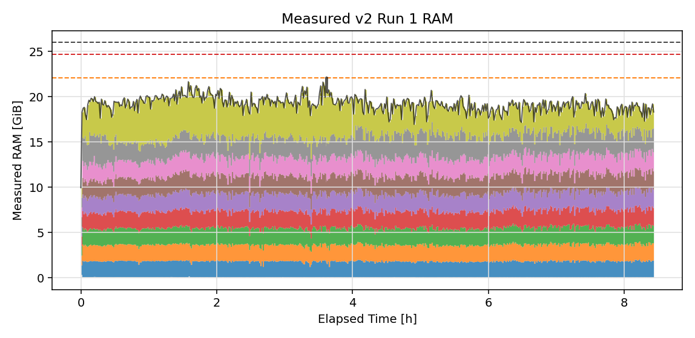

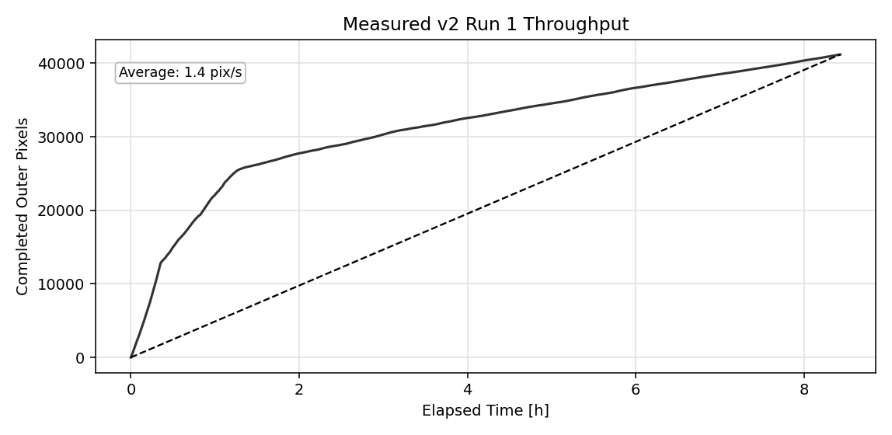

The same run window can be compared directly against the dynamic `9`
stochastic full-sky simulation:

```bash
./.conda/bin/python scripts/plot_schedule_simulation_comparison.py \
  --series dynamic-9=docs/assets/benchmarking/0.1.0/scheduler-comparison/dynamic-9-ram-bin-seed23.npz \
  --measured-run "v2 run 1,2026-04-21T03:26:18.689803+00:00,2026-04-21T11:52:14.245808+00:00" \
  --build-log /Volumes/Data/Galaxy/aosky/gnao-baseline/phase14-dynamic/build.log \
  --limit-to-measured-run \
  --ram-output docs/assets/benchmarking/0.1.0/scheduler-comparison/stochastic-dynamic9-vs-v2-run1-ram.png \
  --throughput-output docs/assets/benchmarking/0.1.0/scheduler-comparison/stochastic-dynamic9-vs-v2-run1-throughput.png \
  --title-prefix "Stochastic Dynamic 9 Simulation vs v2 Run 1"
```

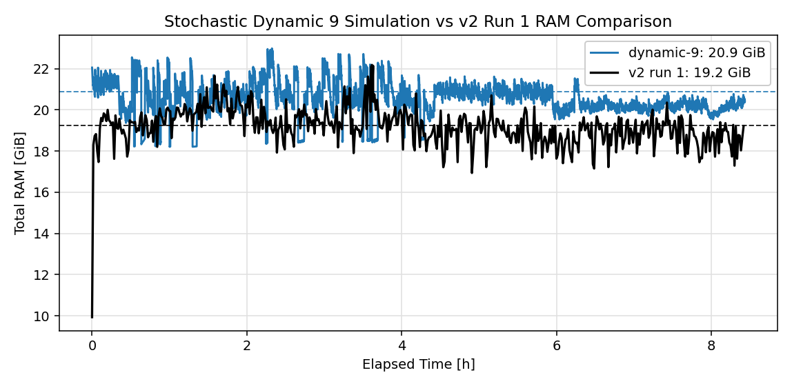

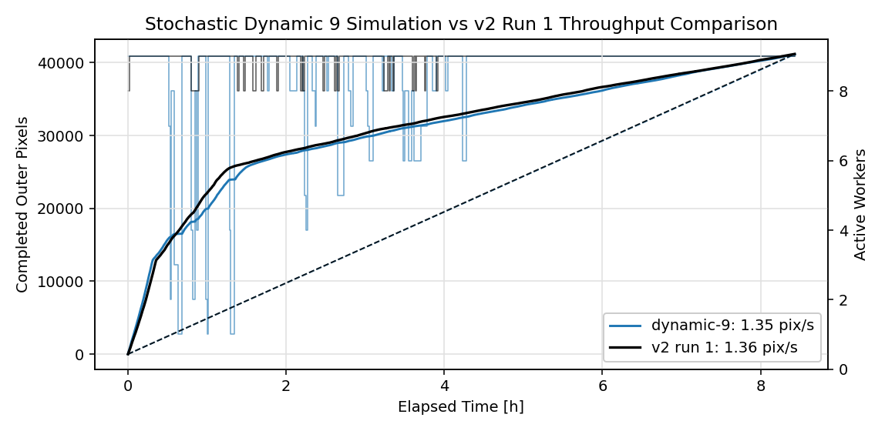

Interpretation:

- Dynamic `9` processed `41,184` outer pixels before the manual stop, leaving
  `7,968` remaining and `0` failed.
- Memory behavior was substantially better than static `9/6`: only `3` samples
  reached trim, none reached pause, and peak total RAM stayed at `22.18 GiB`.
- The cropped dynamic `9` simulation matches the measured throughput closely:
  `1.36 pix/s` simulated versus `1.36 pix/s` measured over the same elapsed
  window. This is a strong validation of the stochastic runtime model.
- The RAM simulation is conservative for this run. Measured RAM stayed below
  the simulated curve for much of the window, leaving enough headroom for more
  workers to remain active than the simulation expected.
- The extra measured memory headroom did not translate into higher throughput,
  which is plausible because workers were already nearly saturated and the
  dense-tail cost appears compute/cache/GPU limited rather than memory-guard
  limited.
- The close measured/simulated agreement makes the full-run dynamic `9`
  estimate credible: `1.11 pix/s` versus `0.83 pix/s` for the static scheduler,
  or about `34%` higher throughput and a `25%` shorter expected traversal.
- Conclusion: the dynamic scheduler is behaving as intended from a memory
  perspective, and the runtime simulation is good enough for scheduler-policy
  comparison. The RAM model should be treated as conservative rather than as an
  exact live-memory predictor.
